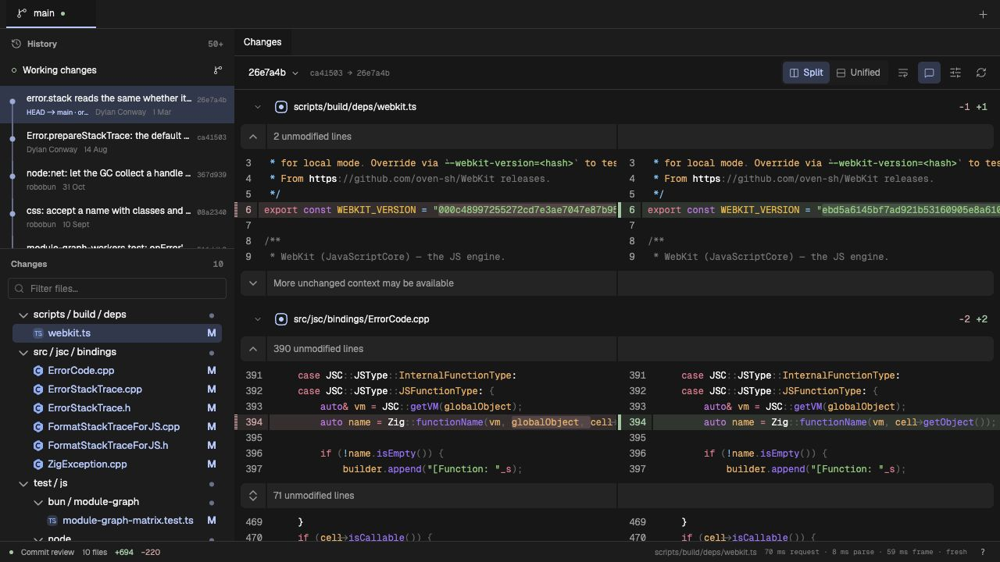
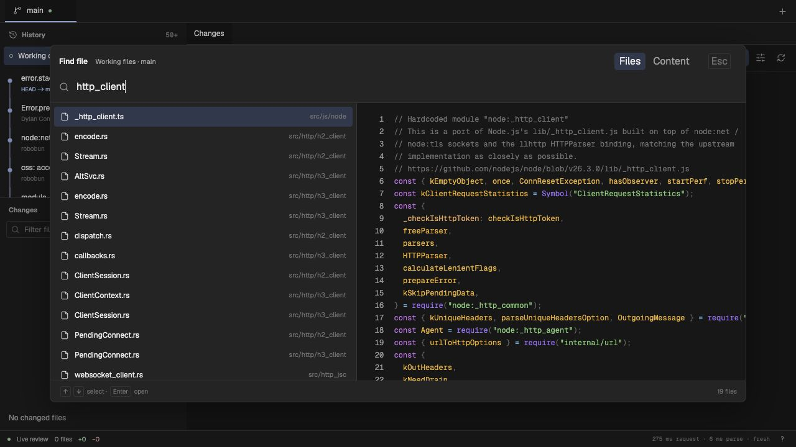

# med

A local Git review app for macOS and Omarchy Linux. Browse commits, branches, and worktrees; review every changed file in one continuous diff; open full files without changing the checkout.



## Features

- **Continuous review.** Keep all changed paths in view. Switch between split and unified diffs, expand context, wrap lines, and add notes to selected lines.
- **Branches and worktrees.** Tabs find existing worktrees automatically. View a branch without a worktree directly from its Git objects. Selecting a commit does not check it out.
- **Full-file browsing.** The right sidebar includes unchanged and untracked files in the selected worktree. Preview a file with one click; keep its tab with a double-click. Historical before/after versions are available from the diff.
- **File and content search.** Preview results beside the list. File search ranks open and recent paths within the selected source. Resume the last query and preview position.
- **Line history.** Select a line or range in a full file to see its Git blame attribution.
- **Live themes.** Preview Vitesse, Rosé Pine, Tokyo Night, and Graphite palettes. Geist and Geist Mono load locally.
- **Keyboard commands.** Press `?` for a searchable command guide with keycaps. No space-key leader.



med reads the repository. It does not stage files, switch branches, run repository scripts, or modify the source under review. Review notes stay on the local host for the session.

## Setup

Use an existing checkout of this project. Install Git and Node **22.12 or newer**; Node 24 LTS is used for validation. Supported targets are macOS and Omarchy Linux. The npm package is not published yet.

```sh
npm ci
npm run build
node dist/cli.js /path/to/repository
```

The command starts a local server and opens a private browser URL. Keep the terminal open. Use `Ctrl+C` to stop it.

```sh
# Keep a stable origin for saved browser preferences.
node dist/cli.js /path/to/repository --port 4173

# Print the URL without opening the browser.
node dist/cli.js /path/to/repository --no-open
```

To have an agent set it up, give it this instruction:

> Set up med from this checkout for macOS or Omarchy. Check Git and Node, install the project dependencies, build it, and open it against my chosen repository. Set up the optional Zoekt search helper if Go is available. Report the local URL and any missing prerequisite. Do not run code from the repository being reviewed.

### Indexed branch search

Set up the optional [Zoekt](https://github.com/sourcegraph/zoekt) search helper once. This command builds pinned binaries and saves them in the user cache:

```sh
node dist/cli.js --setup-search
# After installing the package: med-diff --setup-search
```

Setup needs Go. If it is missing, install it with `brew install go` on macOS or `sudo pacman -S go` on Omarchy, then repeat the command. Normal use needs only the compiled binaries, not Go. There is no Docker container, system service, or Git hook to install.

Start med as usual. It uses the helper when installed and builds indexes in the background. **Content search reads committed branch content** and opens results from the exact commit shown in the picker. Unsaved, uncommitted, and untracked content is not included. The file-name picker and Files sidebar still browse the current worktree.

med checks branch commit IDs when repository watchers report changes, with a 10-second poll as a backup. New commits trigger incremental index builds. Adding or deleting an indexed branch triggers a full rebuild. Builds are serialized per repository. Up to 64 local branch tips are indexed, with branches used by worktrees given priority.

If the helper is missing, the index is rebuilding, or indexing fails, search falls back to Git against the same committed content. Historical commits outside the index also use Git. You can use the app during the initial build.

The default cache is `~/.cache/med/search`, or `$XDG_CACHE_HOME/med/search` when set. Use `MED_SEARCH_CACHE` to choose another location. For an existing helper build, set `MED_ZOEKT_BIN` to the directory containing both `zoekt-git-index` and `med-zoekt`.

The [integration report](docs/validation/ZOEKT_INTEGRATION.md) includes a search screenshot, data flow, checks, and built-host API timings. The [engine benchmark](docs/validation/ZOEKT.md) records index costs and a ten-branch workload. These measurements exclude browser rendering.

### Other inputs

```sh
node dist/cli.js --patch change.patch
git diff | node dist/cli.js --patch -
node dist/cli.js --files old.ts new.ts
```

To check the packaged launch path locally:

```sh
npm pack
npx --yes --package ./med-diff-0.1.0.tgz med-diff /path/to/repository
bunx --package ./med-diff-0.1.0.tgz med-diff /path/to/repository
```

The executable uses Node, including when launched through `bunx`. The package serves compiled assets; it does not need a Vite development server.

## First review

1. Select a commit in the left history panel, or select working changes. Commit diffs compare with the first parent; merge commits are labeled accordingly.
2. Select a changed path to move to it in the diff stream. Double-click the path to open its current file in the selected worktree.
3. Use the top branch tabs or `+` to select another branch. A branch with a worktree opens that directory; a branch without one opens committed content.
4. Use the file picker or right Files sidebar to open unchanged files. A preview does not replace your current review until you open it.
5. Select text lines in a full file and toggle blame for their history. Open the command palette to change theme or find other actions.

| Action                            | macOS        | Omarchy Linux             |
| --------------------------------- | ------------ | ------------------------- |
| All commands and shortcuts        | `?`          | `?`                       |
| Command palette                   | `⌘K`         | `Ctrl+K`                  |
| Find a file                       | `⌘⇧K`        | `Ctrl+Shift+K`            |
| Search file contents              | `⌘⇧F`        | `Ctrl+Shift+F`            |
| Toggle left / right sidebar       | `⌘B` / `⌘⇧B` | `Ctrl+B` / `Ctrl+Shift+B` |
| Resume search                     | `⌥R`         | `Alt+R`                   |
| Keep preview tab                  | `⌥P`         | `Alt+P`                   |
| Toggle selected-line blame        | `⌥B`         | `Alt+B`                   |
| Close current file                | `⌥W`         | `Alt+W`                   |
| Close all files in this workspace | `⌥⇧W`        | `Alt+Shift+W`             |
| Close other files                 | `⌥⇧O`        | `Alt+Shift+O`             |

Close actions preserve the Changes tab and other workspaces. Desktop or browser shortcuts can take priority over a web app; the command palette provides the same actions.

## Development

```sh
npm run dev -- /path/to/repository
```

Open the Vite URL with the `#token=…` fragment printed by the API host. Vite proxies API requests to that host. Production builds need no proxy.

```sh
npm run typecheck
npm run lint
npm run test:unit
npm run test:browser
npm run format:check
npm run build
```

The UI uses React, [Pierre Diffs and Trees](https://pierre.computer/), Base UI, and StyleX. Vite 8 uses Rolldown and Oxc; Oxlint, Oxfmt, and Vitest provide checks. Zod validates the host protocol. [Architecture](ARCHITECTURE.md) describes the boundaries and data flow.

## Limits and evidence

Binary and unsupported files show metadata only. Text above 8 MiB, 200,000 lines, or 250,000 characters on one line is not rendered. Large supported text uses plain rendering. File manifests stop at 50,000 entries. Missing files are shown as missing; historical content is not silently substituted. See [file browsing](docs/FILE_BROWSING.md) for details.

History follows the selected worktree's HEAD ancestry. Shallow clones can lack the parent needed for a comparison. Blame has the same history limit and is unavailable for files without history or files that require Git content conversion.

This is a browser app backed by a local server. Native desktop packaging, shared persistent review notes, and complete Hunk feature parity are not implemented.

- [Navigation validation and screenshots](docs/validation/NAVIGATION.md)
- [Zoekt benchmark: setup cost, search latency, and reproducible harness](docs/validation/ZOEKT.md)
- [Baseline diff performance](docs/validation/RESULTS.md)
- [Theme and workspace validation](docs/validation/UI_UPDATE.md)
- [Feature status and navigation behavior](docs/SNACKS_REVIEW.md)

Hunk's retained semantic source and tests carry their original [MIT notice](upstream/HUNK-LICENSE). [Source provenance](upstream/HUNK.md) records the pinned revision and adaptations.
