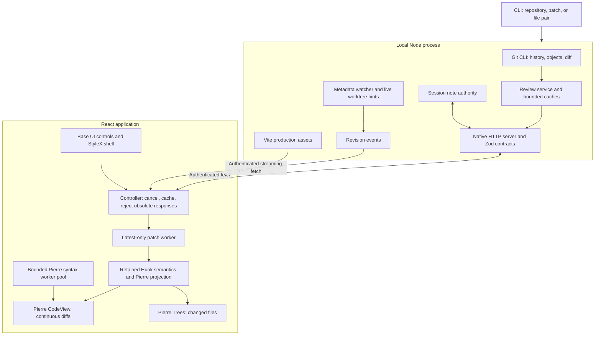

# Continuous diff review: implemented architecture

Status: integrated implementation, 19 September 2026. The user approved implementation after the source audit and added commit-history navigation, live themes, and branch/worktree tabs. See [baseline performance](docs/validation/RESULTS.md) and [UI validation](docs/validation/UI_UPDATE.md) for measurements and limits.

Read-only full-file browsing now uses a right sidebar and center file tabs beside a permanent Changes tab. Its source is independent of the selected diff: attached worktrees always provide current files, while unattached branches provide an exact commit tree. Authenticated, bounded list/read endpoints share the existing host and watcher. See [file browsing](docs/FILE_BROWSING.md) for contracts, data flow, limits, and remaining scope, and [browsing validation](docs/validation/FILE_BROWSING.md) for measured results.

## Product and layout

The `apps/med` workspace starts a local Node host and serves a compiled React application. A compact shell uses StyleX, Base UI, and Pierre Diffs/Trees. Selecting a commit reads its Git objects. It does not change HEAD or check out files.

```text
┌ Repository / worktree     Working · Staged · Unstaged · Compare   ┐
├ main ●       feature/review ●       release       +              ┤
├───────────────────┬──────────────────────────────────────────────┤
│ Commit graph      │ Comparison title        Split / Unified      │
│ Paged history     │                          Find · Wrap · Notes  │
├───────────────────┼──────────────────────────────────────────────┤
│ Changed files     │ File A header                                │
│ Path filter       │ Hunks · source selection · context · notes   │
│ Tree and counts   │ File B header                                │
│                   │ Hunks …                                      │
│                   │ File C …                 One scroll surface  │
├───────────────────┴──────────────────────────────────────────────┤
│ Connection · file totals · request / parse / first-frame timing  │
└──────────────────────────────────────────────────────────────────┘
```

All changed paths stay in the tree. Selecting a path reveals it in the continuous diff stream. Binary files, oversized files, and entries without a text patch have explicit metadata rows. The renderer does not invent empty text patches for them. Only nearby code rows are mounted by Pierre's virtualizer.

The graph shows the selected worktree's HEAD ancestry, or the selected branch's ancestry, in topological order with parent edges and paged loading. It is not yet an all-branches repository graph. Pagination stays pinned to a resolved tip. Selecting a merge shows its first-parent diff. A root commit compares with the empty tree. A shallow boundary with a missing parent produces a clear error.

Branch tabs map local refs to worktrees discovered by Git. An attached branch opens its working changes. A branch without a worktree opens its committed snapshot and hides working-copy controls. A stale worktree mapping falls back to the branch snapshot. Detached worktrees remain selectable. No tab action runs checkout or switch.

### Multiple repositories

One host can register several local repositories. Open branch groups their branches and worktrees in one picker; branch tabs can span repositories. There is no separate repository navigation screen. The selected tab controls history, reviews, files, search, and symbols.

A repository family is identified by the canonical Git common directory. Linked worktrees share its opaque registry ID; separate clones have separate IDs. The Git command directory remains a checkout path. Browser tab identities combine the repository ID with a branch name or detached worktree path. File sources retain their exact repository path and, for committed content, object ID.

The host validates registered paths before reads and routes search to the owning repository's service. Discovery replaces worktree membership so removed paths do not remain authorized. Removing a registration revokes its sources and review IDs and releases its watchers and search service. Registration and removal never change reviewed files or Git branches.

Inactive browser tabs retain bounded navigation records. They do not mount separate review renderers. Switching cancels old requests, restores navigation, and reloads mutable content; request generations reject late responses. File navigation is retained for up to 32 workspaces, with up to 12 file tabs each, while only the active file retains loaded bytes in the workspace store.

Base UI supplies tabs and the searchable theme dialog. Theme selection previews the whole application; Enter saves locally, and dismissal restores the saved theme. Semantic CSS variables connect StyleX, Pierre Trees, and the diff theme. Geist fonts and a selected set of Lucide SVG paths ship locally. No runtime dependency was added for these controls. See [theme sources](upstream/THEMES.md).

## Boundaries and dependencies



| Responsibility                                       | Implementation                                                                         |
| ---------------------------------------------------- | -------------------------------------------------------------------------------------- |
| Diff rendering, line virtualization, syntax, context | `@pierre/diffs` 1.4.3; one CodeView, no second virtualizer                             |
| Changed-file tree                                    | `@pierre/trees` 1.0.0-beta.6                                                           |
| Selectors, menus, command and note dialogs, tooltips | `@base-ui/react` 1.8.0                                                                 |
| Layout, themes, focus and density                    | StyleX 0.19.1 and a small CSS reset                                                    |
| Commit graph, separators, simple status elements     | Local React/HTML/SVG code                                                              |
| Browser state and subscription                       | Local controller and React external-store subscription                                 |
| Review semantics                                     | Pinned Hunk source, adapted at module boundaries                                       |
| Runtime schemas                                      | Zod 4.6.5, latest stable at installation                                               |
| Git and process lifecycle                            | Node subprocess API; installed Git CLI                                                 |
| Watch hints                                          | Native recursive watch on macOS/Windows; bounded Chokidar fallback plus reconciliation |
| HTTP and SSE                                         | Native Node HTTP and browser fetch                                                     |

No Hono, Express, query framework, router, generic state store, splitter library, daemon broker, or desktop framework is required. The installed app serves its compiled assets. It never loads the reviewed repository's Vite config or runs its scripts.

Vite 8 supplies Rolldown and Oxc. The official React plugin uses Oxc; the official StyleX plugin still uses Babel internally at build time. Oxlint runs StyleX's validation plugin directly. An integration test confirms that an invalid StyleX declaration fails. Oxfmt formats local code. TypeScript and Vitest provide static and runtime checks. The lockfile pins all versions.

## Hunk reuse and changed scope

The source baseline is Hunk [`9b95a71b76c472bad21ffa5cc6b01b204e2f6f7a`](https://github.com/modem-dev/hunk/tree/9b95a71b76c472bad21ffa5cc6b01b204e2f6f7a). [Provenance](upstream/HUNK.md) records retained modules and adaptations. The original MIT notice is retained.

The port retains review actions, anchors, document projection, geometry, identities, navigation, note limits, reducers, selectors, state/store, validation, and their behavior tests. Local adapters connect these rules to Pierre and the HTTP controller. This is a source port of review semantics, not a port of every Hunk runtime service.

The original proposal considered retaining Hunk's daemon transport and publication protocol. The implemented host uses a smaller direct HTTP contract instead. It does not claim compatibility with Hunk agents, extensions, producer protocols, or publication deltas. The host owns source snapshots and notes. Selection, filtering, scroll, and presentation remain browser-local. There is no shared cursor or cross-client note push.

JJ/Sapling, rich STML, terminal modes, extension execution, branch mutation, merge editing, Zed theme import, and native desktop installation remain outside this version.

## Requests, identity, and invalidation

```mermaid
sequenceDiagram
  participant U as User
  participant C as Browser controller
  participant H as Local host
  participant G as Git
  participant W as Patch worker
  participant V as Pierre stream
  U->>C: Select commit
  C->>C: Cancel old fetch and parse; check bounded cache
  C->>H: Review request with comparison
  H->>G: Resolve objects and obtain bounded patch / metadata
  H-->>C: Review ID, resolved endpoints, files, patch, timing
  C->>W: Parse patch
  W-->>C: Parsed file metadata
  C->>C: Reject result if selection changed
  C->>V: Project all files; render visible rows
  V->>H: Request full source for context expansion
  H-->>V: Matching immutable bytes, or stale error
  G-->>H: Worktree or metadata watch hint
  H-->>C: Revision event
  C->>C: Refresh affected mutable view and history
```

The first request transfers one bounded patch and all file metadata. Initial patch transfer is not paged per file. Parsing runs in a latest-only worker. A new parse terminates obsolete work. Full source reads occur on demand for context expansion. Syntax work uses Pierre's bounded pool.

Twinkleplop supplies tokens for both the worker and main-thread rendering paths. `tools/pierre-highlighter.ts` applies a version-checked integration patch to Pierre 1.4.3 at build time. Pierre retains the worker protocol, queue, cache, diff layout, and line transforms. The adapter in `src/web/highlighting` converts UTF-16 token ranges to Pierre's HAST format, including word-change decorations and theme colours. Markdown fences load their embedded grammars. Unsupported languages use plain text.

The normal build has no Shiki tokenizer or grammar modules. Theme data, theme normalization, and Pierre's token transform utility remain transitive Shiki dependencies. The patch rejects a different Pierre version or a missing source boundary; builds also reject Shiki engine/grammar modules in emitted chunks. Upgrading Pierre requires a new integration audit. `MED_HIGHLIGHTER=shiki bun run build:web` produces the comparison baseline, with the original Pierre engine. Engines cannot switch within a running build, so cached render results cannot cross engines. See [the integration and video comparison](docs/validation/HIGHLIGHTER_INTEGRATION.md).

Full object IDs permit immutable review caching. Symbolic revisions, patches, file pairs, and working changes are re-read. Browser fetches and note loads carry request-generation checks so late responses cannot replace a newer comparison. Note mutations carry an expected revision. The server rejects outdated mutations.

Live note scopes survive review refreshes. Notes on changed files become stale; notes on missing files become orphaned and remain accessible. This version does not infer new line coordinates. Normal branch review notes live in host memory and end when that process closes. Saved agent reviews use a separate persistent store.

Immutable context comes from resolved Git objects. Mutable context validates its captured file/index signature before it is returned. File-pair inputs use frozen byte snapshots. Standalone patches do not claim full-source authority. Patch/file inputs use manual refresh. A stale source request fails instead of mixing current contents with an old patch.

Watch events are hints, not file content. Commit browsing watches Git metadata without opening a watcher for every source file. Working/unstaged views enable live worktree observation. Events are coalesced, and periodic status reconciliation recovers missed changes. Reconnect causes a refresh even when an event revision repeats. A refresh can still replace an entire patch; this version does not promise per-file incremental parsing or stable positions for every live edit.

## Git behavior and resource bounds

Use Git CLI argument arrays with an explicit repository directory. Disable external diff helpers, textconv, and repository fsmonitor hooks. Limit subprocess output while reading; cancel obsolete processes and enforce timeouts. Discover worktrees with Git rather than assuming `.git` is a directory.

| Mode      | Before                     | After                                   |
| --------- | -------------------------- | --------------------------------------- |
| Working   | HEAD or empty tree         | Worktree, including untracked additions |
| Staged    | HEAD or empty tree         | Index                                   |
| Unstaged  | Index                      | Worktree, including untracked additions |
| Commit    | First parent or empty tree | Selected commit                         |
| Range     | Resolved base              | Resolved head                           |
| File pair | Explicit old file snapshot | Explicit new file snapshot              |
| Patch     | Patch-provided before side | Patch-provided after side               |

Range means a direct endpoint comparison, not an implicit merge-base comparison. Worktree selection reads a different working directory and index, with shared Git objects. It does not execute `git switch`. Git CLI is the first backend; libgit2 would require a measured advantage plus matching behavior and packaging tests.

Review and source caches have byte and entry bounds. Browser canonical parsed reviews and sources have separate budgets. Pierre receives a separate render copy because context hydration mutates metadata. These cache limits are not a total-process memory cap; active hydrated render models need separate profiling. Host requests, event streams, file inputs, note text, and total notes also have bounds. Large or non-text files keep explicit metadata. Output limits, source limits, parsing, syntax work, and DOM virtualization are separate controls.

The Bun test exposed a real watcher cost: opening watchers across the checkout exhausted file descriptors. The host now keeps immutable commit browsing on metadata watchers and uses native recursive observation for live files where supported. The validation report separates first host request, warm cache, browser parse, and first rendered-frame timing. It does not infer sustained frame rate or cold-disk performance from HTTP latency.

## File review order

1. `src/shared/protocol.ts`: shared wire contract and comparison variants.
2. `src/host/repository/` and `src/host/server.ts`: Git semantics, source lifetime, authentication, and limits.
3. `src/web/data/`: response guards, cache policy, projection, and note synchronization.
4. `src/web/App.tsx`, `components/`, and `theme.stylex.ts`: layout and controls.
5. `tests/`, `scripts/`, and `docs/validation/`: behavior, package checks, and reproducible measurements.

[Parallel integration record](docs/IMPLEMENTATION_PLAN.md) and [original audits](docs/audit/) explain the source decisions. Audit files describe their pinned inspection baseline; this file describes the implemented system.

## Saved agent reviews

The CLI uses a stable default port (4173) and private state directory (`~/.local/state/med`). A persistent credential and per-port connection record let `review repos` and `review create` find the running host. The browser exchanges the launch token for a same-origin HttpOnly cookie, then removes the token from the URL. Saved links contain only a review ID. They cannot register repositories.

`src/shared/saved-review.ts` defines a review bundle with one or more repository/comparison targets. The host resolves commit references and captures the patch and supported source bytes before it writes a bundle. Mutable working comparisons are labelled as captured changes. The store keeps comments separate for each target, while feedback export and clear operate on the whole bundle. Revision checks prevent a stale clear from deleting newer comments. Atomic private files and a cross-process write lock protect persistent records.

The browser opens one target at a time. Saved source does not follow watcher events. The normal file browser and commit history remain available; the header shows when the user has left the saved comparison. Feedback export uses captured source, including selected lines and adjacent context. Saved file access requires the repository family to remain registered, but a surviving checkout can replace a removed linked worktree as the session anchor.

See [agent integration](docs/AGENT_INTEGRATION.md) for the CLI contract, repository selection policy, data limits, and user-confirmed `AGENTS.md` guidance.
