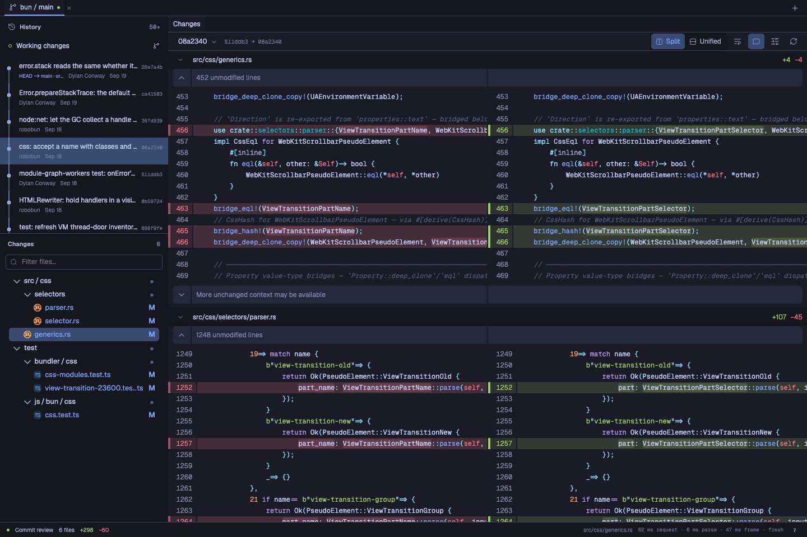
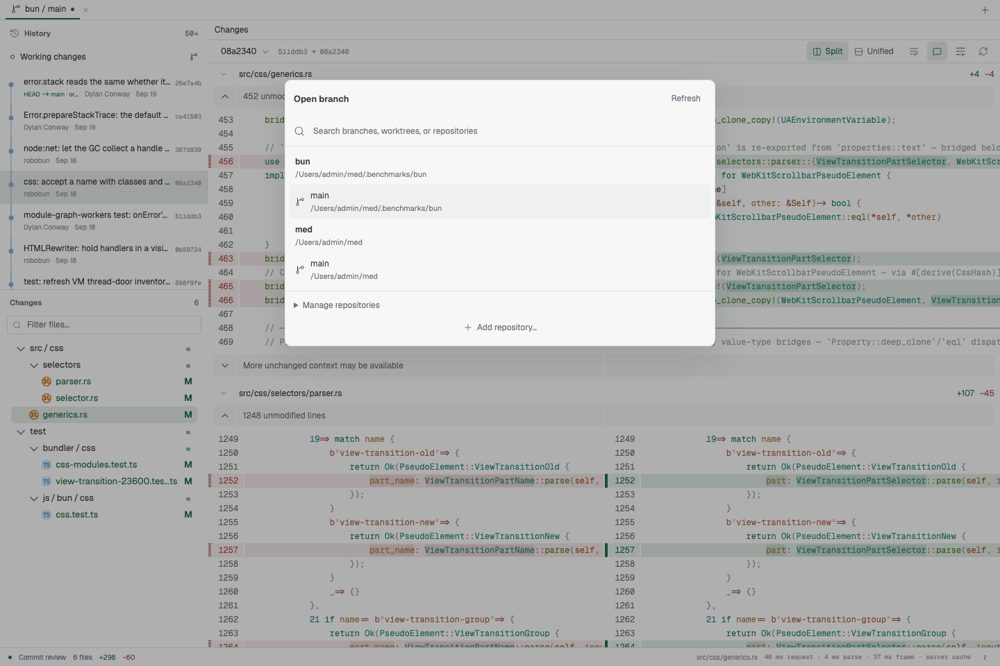
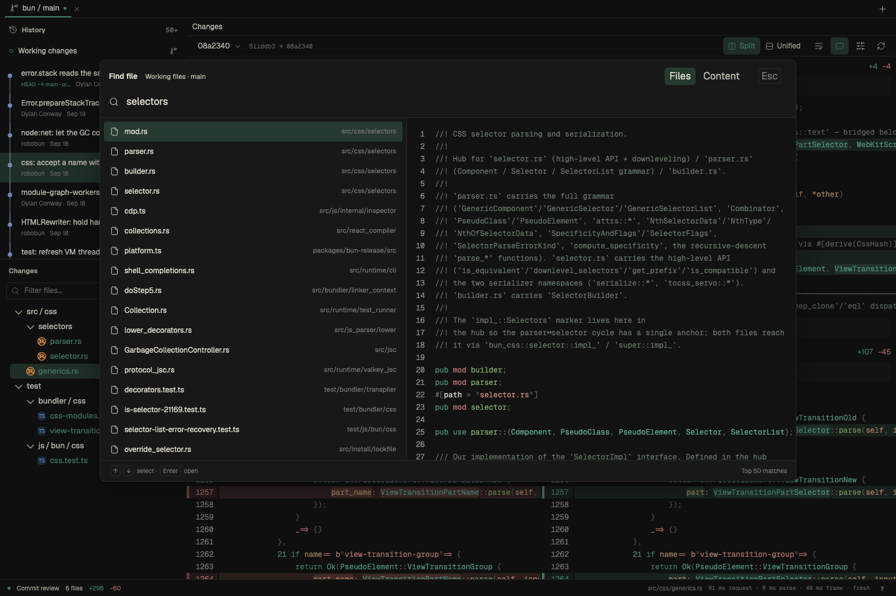
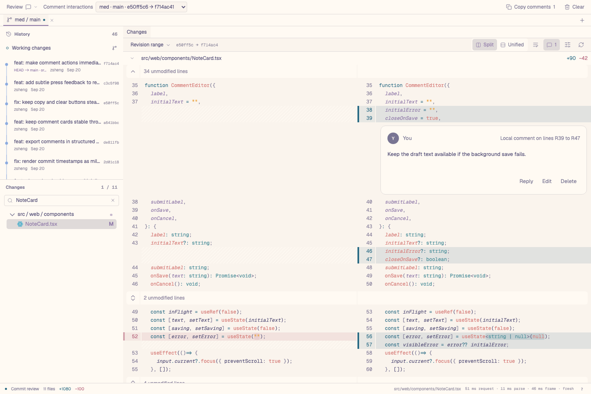

# med

Workbench’s local Git review app for macOS and Omarchy Linux. Review changes, explore branches, and read code without changing your checkout.

Review commits and working changes in a continuous split or unified diff. Expand context, wrap lines, and comment on a line or range.



_Bun · Tokyo Night_

## Work across repositories

Keep repositories, branches, and worktrees in one window. Each tab has its own history, files, and search scope.



_Bun and med · Vitesse Light_

## Find and read code

Find files or search committed code with a preview. Open files in tabs, jump to symbols, and inspect line blame. Keyboard shortcuts and Vim navigation are built in. Twinkleplop supplies syntax colours; files without a supported grammar remain readable as plain text.



_Bun · Vitesse Dark_

## Review agent changes

Open an agent's review link, leave line comments, then copy comments from all its repositories back to the agent. Comments appear immediately and stay attached to the captured code.



_Example saved review in med · Rosé Pine Dawn_

med runs in your browser with a local server. It does not edit reviewed files, stage changes, switch branches, or run code from the repository. Normal review notes stay on the local host for the session. Saved agent reviews keep captured source and comments across restarts.

## Get started

From the Workbench root, with Bun, Git, and Node **22.12 or newer** installed:

```sh
bun install --frozen-lockfile
bun run build:med
bun run med /path/to/repository
```

The command opens the app in your browser. Keep the terminal open; press `Ctrl+C` to stop it. med is the private `@workbench/med` app in this monorepo.

Pass several repository paths to open them in one app:

```sh
node apps/med/dist/cli.js /path/to/frontend /path/to/backend
```

Use **Open branch** (`+`) to select a branch or worktree, or to add and remove repositories for the current session. Removing a repository from med does not delete its files or branches.

### Agent review links

The local server uses port **4173** by default. With med already running, an agent can create a review from exact start and end commits:

```sh
node apps/med/dist/cli.js review create --title "Agent changes" \
  --repo /path/to/repository --base <start-commit> --head <end-commit>
```

The command prints a clickable review link. Use `--working` instead of `--base` and `--head` to capture current working changes. The compact review bar has **Copy comments** and **Clear** side by side. A checkmark confirms a successful copy. The **Review** menu contains the review details.

To compare a feature branch with its base branch, use `--base main --head HEAD` (or `develop`, `origin/main`, or another local Git ref). This compares the two tips directly. For a pull-request-style diff, use their common ancestor as the base; see [branch comparisons](docs/AGENT_INTEGRATION.md#compare-with-a-base-branch). Saved links capture exact commits. Create a new link after a merge or new commits.

See [agent integration](docs/AGENT_INTEGRATION.md) for multi-repository manifests, repository selection, and suggested `AGENTS.md` guidance. Confirm that guidance with the user before adding it to their instructions.

### Optional search tools

- **Universal Ctags** enables symbol search. Install it with `brew install universal-ctags` on macOS or `sudo pacman -S ctags` on Omarchy.
- **Zoekt** adds indexed branch search and is required for project symbol search. With Go installed, run `node apps/med/dist/cli.js --setup-search` once.

Content search reads **committed content**. It does not include uncommitted or untracked changes. Without Zoekt, content search falls back to Git. Symbol language support depends on the installed Ctags parsers.

## Useful shortcuts

On Linux, use `Ctrl` in place of `⌘`.

| Action                     | Shortcut |
| -------------------------- | -------- |
| Command palette            | `⌘K`     |
| Find a file                | `⌘⇧K`    |
| Search file contents       | `⌘⇧F`    |
| Symbols in this file       | `⌘O`     |
| Symbols in the project     | `⌘⇧O`    |
| All commands and shortcuts | `?`      |

Vim navigation is enabled by default; the command palette can toggle it. In a focused Vim file view, `?` searches backward; use `⌘K` to open commands.

See the [usage guide](docs/USAGE.md) for all shortcuts, search setup, patch and file inputs, and limits.

## Libraries and tools

| Project                                                            | Use in med                                             |
| ------------------------------------------------------------------ | ------------------------------------------------------ |
| [Pierre Diffs and Trees](https://github.com/pierrecomputer/pierre) | Code and diff rendering; file trees                    |
| [Twinkleplop](https://github.com/pngwn/twinkleplop)                | Syntax highlighting                                    |
| [Base UI](https://base-ui.com/)                                    | UI controls and dialogs                                |
| [Universal Ctags](https://github.com/universal-ctags/ctags)        | Symbol extraction                                      |
| [Zoekt](https://github.com/sourcegraph/zoekt)                      | Indexed search across committed branches               |
| [React](https://react.dev/) and [StyleX](https://stylexjs.com/)    | UI components and styles                               |
| [Chokidar](https://github.com/paulmillr/chokidar)                  | Watch repository changes                               |
| [Zod](https://zod.dev/)                                            | Validate messages between the browser and local server |
| [Geist and Geist Mono](upstream/GEIST.md)                          | Locally loaded fonts                                   |

Build and test tools: TypeScript, Vite, Vitest, Playwright, Oxlint, and Oxfmt. See [package.json](package.json) for the full list and pinned versions.

### Design and source references

- **[Zed](https://zed.dev/)** — a reference for selected UI designs, including theme preview, confirm, and dismiss behavior. See [theme provenance](upstream/THEMES.md).
- **[snacks.nvim](https://github.com/folke/snacks.nvim)** — a reference for the file picker and code preview. See the [feature comparison](docs/SNACKS_REVIEW.md).
- **Hunk** — adapted review logic and tests. See [source provenance](upstream/HUNK.md) and the original [MIT notice](upstream/HUNK-LICENSE).

## Development

Install dependencies from the Workbench root. Use the root `bun.lock`; do not create an app lockfile. Run app-specific checks with `bun run check:med`.

```sh
bun run dev:med /path/to/repository
```

Open the Vite URL with the `#token=…` fragment printed by the API host.

See the [architecture](ARCHITECTURE.md), [test design and commands](docs/TESTING.md), and [limits and validation reports](docs/USAGE.md#limits-and-evidence).
