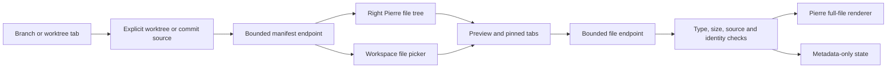

# Full-file browsing

File browsing is read-only and stays in the review workspace. It uses the existing Pierre renderer and tree, Base UI controls, and StyleX themes.

## Layout and navigation

```text
┌ main ●             feature/auth ●             release           ┐
├──────────────┬───────────────────────────────┬───────────────────┤
│ History      │ Changes │ session.ts ×        │ Files             │
│              ├───────────────────────────────┤ Working files     │
│ Changes      │                               │                   │
│ session.ts   │ Diff stream or full file      │ src/              │
│ token.ts     │                               │   session.ts      │
│              │                               │   token.ts        │
└──────────────┴───────────────────────────────┴───────────────────┘
```

- The right Files sidebar starts closed. Use Command–Shift–B or the command guide (`?`) to open it. On narrow windows, opening one sidebar closes the other.
- The permanent Changes tab keeps the continuous diff view and its scroll position while a file is open.
- A single click in Files opens a reusable preview tab. A double-click, or Enter on a selected file, keeps that tab open. Opening another preview replaces only the previous unpinned preview.
- A single click in Changes reveals its diff. A double-click opens the current file from the selected workspace. The view menu also provides an explicit open-file action.
- File tabs and the active tab are kept separately for each workspace during the session. There are at most 12 file tabs per workspace and eight retained workspaces. Only the active file's bytes are retained by the workspace controller.
- The full-file header shows its source, read-only state, and a refresh action. Detected working-file changes mark a loaded file stale; refresh it to load new bytes.

## The source stays explicit

| Workspace tab             | Files tree and picker                                 | Full-file content                                     |
| ------------------------- | ----------------------------------------------------- | ----------------------------------------------------- |
| Existing worktree         | Existing tracked and untracked paths in that worktree | Current worktree bytes, including uncommitted changes |
| Branch without a worktree | Tree at its resolved branch-tip commit                | Git blobs at that commit                              |
| Detached worktree         | Existing paths in that worktree                       | Current worktree bytes                                |

Selecting an older history commit changes the diff. It does **not** change the working-file source for a worktree. Double-clicking a changed path still opens the file as it exists in that worktree now. A missing path shows a missing-file message; it does not silently fall back to historical content.

Where a diff side resolves to a commit object, **Open before** and **Open after** open its exact historical file version in a separate, labeled tab. The old side uses the previous path for a rename. Index and other mutable diff sides are not presented as immutable historical versions.

A branch without a worktree needs no checkout. Its source includes the full resolved commit ID, so a directory response cannot be combined with bytes from a different commit. Switching workspace cancels obsolete reads.

## File and sidebar shortcuts

Press **⌘⇧K** to open the file picker. **⌘B** toggles the left review sidebar; **⌘⇧B** toggles the right Files sidebar. **⌘K** opens commands. Control is also accepted in place of Command.

Space has no application shortcut. Press `?` to see and run all commands with keycaps. The separate title bar is removed; branch tabs remain.

The picker searches only the active workspace's file manifest. It uses filename-first fuzzy matching, smart case, and at most 50 results. `file:line` opens a matching file at the requested line; a trailing column can be accepted but is not used. Results from another worktree are never merged into this list. Open and recent files get a ranking bonus, but only within this manifest. Previewing a result does not change the current tab. Use Option–R to restore the last search, including selection and preview scroll.

## Bounds and metadata-only states

| Input                                                                        | Current behavior                                       |
| ---------------------------------------------------------------------------- | ------------------------------------------------------ |
| Recognized binary content                                                    | Metadata only; no content renderer                     |
| Invalid UTF-8                                                                | Unsupported-encoding message; no content renderer      |
| Symlink, submodule, or unsupported filesystem object                         | Metadata only; no traversal into another source        |
| Text above 8 MiB                                                             | Metadata only                                          |
| Text above 200,000 lines                                                     | Metadata only                                          |
| A line above 250,000 characters                                              | Metadata only                                          |
| Otherwise supported text above 1 MiB, or with a line above 20,000 characters | Plain-text rendering with syntax highlighting disabled |
| Smaller supported text                                                       | Syntax-highlighted rendering                           |

The line-length limits use JavaScript string length. Plain-text mode still loads and decodes the bounded file; it is not a streaming byte preview. File size alone is not a guarantee of rendering speed.

Ignored paths are hidden by default. Show ignored files adds them to the worktree manifest; Git internals remain excluded. The host checks paths and file identity, rejects source changes during reads, and does not follow symlink ancestors.

The manifest is bounded at 50,000 entries with a 16 MiB estimated-content budget. This is one bounded manifest, not a paged directory API. A partial manifest shows a limit message; a Git command that exceeds its output budget returns an error. Empty directories are not represented by Git-backed listings.

## Data flow and remaining scope



The host exposes authenticated `POST /api/browse/list` and `POST /api/browse/read` endpoints. Both accept the source explicitly. The UI validates responses against that source and cancels obsolete requests.

Content search and selected-line Git blame are available through authenticated source-scoped endpoints. See [the navigation guide](SNACKS_REVIEW.md) for behavior and shortcuts. File editing, saved navigation across app restarts, paged directory loading, and split-to-side full-file previews are not implemented. Standalone patch and two-file sessions do not expose repository browsing.
