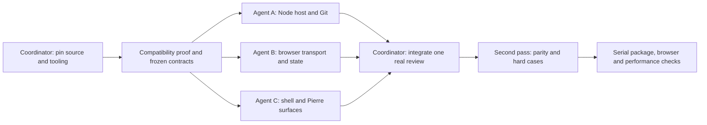

# Implementation and parallel integration plan

Status: implemented integration record, 19 September 2026. The user approved parallel implementation after this plan. The sections below retain the original gates; they are not all completion claims. [Current architecture](../ARCHITECTURE.md) and [validation results](validation/RESULTS.md) describe the actual result.

## Completed integration and scope changes

- The coordinator pinned dependencies, defined shared Zod contracts, and owned builds, package checks, benchmarks, and final integration.
- Three agents worked on host/Git, retained Hunk semantics/browser data, and the StyleX/Base UI/Pierre interface. Ownership was scoped by directory in one shared checkout.
- The second pass added patch/file inputs, stale/orphaned notes, cancellation, cache bounds, and input-only views.
- Commit history and direct range selection moved into the first release at the user's request. History is HEAD ancestry with paged parent edges, not an all-branches explorer.
- The host uses direct native HTTP, not Hunk's daemon or publication protocol. Notes and source authority stay on the host; local selection/filter/presentation stay in the browser.
- Retained Hunk semantics and tests are recorded in `upstream/HUNK.md`. Complete Hunk runtime parity and native desktop packaging are deferred.
- Integrated browser, package, and performance checks run serially. The results report lists measured gates and unmeasured cases explicitly.

## 1. Foundation owned by the coordinator

Complete one small vertical proof before broad UI work. The coordinator owns `package.json`, the lockfile, Vite/Vitest/Oxlint/Oxfmt/TypeScript/StyleX configuration, source provenance, and shared interfaces. Other agents can prepare source maps and fixtures, but cannot change versions independently.

The proof must establish:

1. Exact published versions and peer dependencies for the selected tools and Pierre components.
2. Vite development and production builds with StyleX, React refresh, a Base UI portal, Pierre tree, and continuous multi-file view.
3. StyleX lint coverage through Oxlint or a documented narrow ESLint fallback.
4. One pinned Hunk document and action round trip through the proposed headless host.
5. A bounded state snapshot/delta schema tied to publication and state revision. Cover notes, filters, selection, and context expansion state.
6. A decision on direct in-process HTTP adaptation versus retained daemon transport. Record the process and dependency costs.
7. A supported Pierre approach for deferred file contents, annotation ranges, reveal, theme mapping, and scroll anchoring. An all-file sidebar with a focused-file body does not pass.

The installed desktop host remains a product decision. The proposed first distribution is the requested local CLI plus browser. Keep a host interface; do not add a desktop framework during unrelated work.

## 2. Freeze the contracts

These names describe interfaces to agree before delegation; they are not claims about upstream export names.

| Contract               | Required contents                                                               | Owner                             |
| ---------------------- | ------------------------------------------------------------------------------- | --------------------------------- |
| Review document        | Ordered files; source/content identity; semantic ranges                         | Coordinator, based on Hunk        |
| Review publication     | Generation-scoped resource descriptors; separate from the review document       | Coordinator, based on Hunk        |
| Review position        | Generation and state revision; validation and stale/reset rules                 | Coordinator                       |
| State projection       | Bounded snapshot/delta; changed state; acknowledgement/reconnect rules          | Coordinator with host/data agents |
| Host lifecycle         | Open, subscribe, dispatch, reconcile, close; cancellation and disposal          | Host agent after review           |
| Browser review adapter | Current projection, subscribe, dispatch, ensure resource, reveal intent         | Data agent after review           |
| Renderer projection    | Stable item ID/version; source-side line map; notes; gaps; pending/error states | UI agent after review             |
| Local preferences      | Theme, width, wrapping, mode; separate from shared state                        | UI agent                          |

One source of truth owns each identity and action. Agents must not create independent versions of the same contract. Protocol changes require the coordinator to update fixtures and consumers together.

## 3. Parallel lanes

With four available agent slots, use the coordinator plus three implementation agents. Do not run four independent frontend implementations.

| Lane             | File ownership                                                             | Independent work                                                                                                         | Acceptance evidence                                                                                       |
| ---------------- | -------------------------------------------------------------------------- | ------------------------------------------------------------------------------------------------------------------------ | --------------------------------------------------------------------------------------------------------- |
| Coordinator      | `src/shared/`, `upstream/`, build/config/manifests, integration fixtures   | Port semantic tests; enforce browser import boundary; review contract changes                                            | Retained conformance cases pass; one shared schema; source provenance                                     |
| A — host         | `src/host/`, `src/cli/`, host tests                                        | Replace required Bun calls; own store/load/reload; Git inputs; worktree discovery; watch; serve resources/actions/assets | Real Node tests with temporary Git repos, linked worktrees, cancel/close, source races, bounded output    |
| B — browser data | `src/web/data/`, transport fixtures/tests                                  | Capability-auth fetch/SSE, revision mirror, resource queue/cache, reset/reconnect, stale response rejection              | Fake server proves reordering, gaps, action conflicts, retry, bounded memory                              |
| C — review UI    | `src/web/review/`, `src/web/ui/`, `src/web/host/`, browser component tests | StyleX shell/themes; Base UI controls; Pierre stream/tree; note/context/selection projection                             | All files stay in one stream; keyboard/focus, scroll anchoring, theme and worker checks in a real browser |

Each lane starts from the same fixtures. The data lane supplies a fake adapter so the UI lane can work before Git is ready. The host lane tests protocol responses without depending on a finished UI. The coordinator reviews one useful end-to-end path early: open → view all files → select a path → save a source file → retain the reader's position.

Use separate commits or worktrees when implementation starts. Do not overwrite another lane's files. Submit shared-interface changes to the coordinator first. Only the coordinator changes the lockfile or dependency versions. Run heavyweight browser/performance checks serially against one integrated build so agents do not distort measurements.

## 4. Scope after the first integrated slice

Work in three parallel lanes again, with a shared integration gate between each batch:

| Host lane                                      | Browser data lane                         | UI lane                                              |
| ---------------------------------------------- | ----------------------------------------- | ---------------------------------------------------- |
| Staged/unstaged/commit/patch/file-pair inputs  | Cache lifetime and eviction               | Find/filter/file/hunk navigation                     |
| Mutable-source capture or stale rejection      | Notes/selection state synchronization     | Notes edit/reply/remove, copy/range selection        |
| Watch recovery, burst coalescing               | Reconnect and expired-generation recovery | Context expansion, anchors and truthful stale states |
| Existing-worktree selection and metadata cases | Request priorities and load limits        | Large-file, binary/conflict/submodule presentations  |

Do not silently drop Hunk behavior. Update the [parity matrix](audit/HUNK_UI.md#feature-matrix) as each feature is carried, replaced, or deferred. Full history graphs, JJ/Sapling, extension/agent compatibility, rich STML, and desktop installation remain visible scope decisions.

## 5. Integration gates

| Gate         | What must pass                                                                                                                                                               |
| ------------ | ---------------------------------------------------------------------------------------------------------------------------------------------------------------------------- |
| Static/build | Formatting, Oxlint, StyleX validation, explicit type checks, production browser/host builds                                                                                  |
| Semantic     | Retained Hunk conformance cases; zero-sided hunks, CRLF, missing final newline, notes, ordering and source identity                                                          |
| Git/host     | Linked worktrees; staged/unstaged boundaries; filenames with whitespace; renames; untracked files; unborn HEAD; save/stage races; process cancellation                       |
| Transport    | Publication/state consistency; missing/reordered events; stale chunks; reconnect/reset; capability/origin validation; output and cache bounds                                |
| Browser      | Continuous stream; off-screen file reveal; selection/copy; note/context actions; stable anchor on live updates; Base UI focus; portal/Pierre theme sync; emitted worker URLs |
| Package      | Packed tarball runs through `npx` and `bunx` from a path with spaces; no dev server/build tool at runtime; asset lookup and clean shutdown                                   |
| Performance  | Cold/warm open, save, worktree target change, many files, huge files, rename-heavy reviews, watcher degradation; latency and memory by phase                                 |

Use Vitest Node tests for semantics/host/protocol and Vitest Browser Mode for real DOM, workers, focus, and layout. Carry useful upstream cases; replace terminal-only checks. Do not add tests that merely repeat a low-impact style constant.

Performance evidence must include Git, full host parsing, resource transfer, browser projection, syntax work, and rendering. A fast virtualized list does not prove a fast application. Record baseline measurements before optimizing Hunk's repeated patch signatures or changing Git backends.

## 6. Definition of the first reviewable result

A user can launch the packed app, choose an existing worktree and comparison, see every changed path, read a continuous diff, navigate with mouse or keyboard, select/copy text, use ordinary notes and context expansion, and continue reading through live updates. Resource limits and unsupported inputs have explicit states. The report states which Hunk features remain deferred, which runtimes/browsers were tested, and what the measurements show.

The coordinator provides the integrated result, a short change summary, evidence, remaining limits, and a file review order. Passing independent agent tests is not a substitute for this final integration check.
