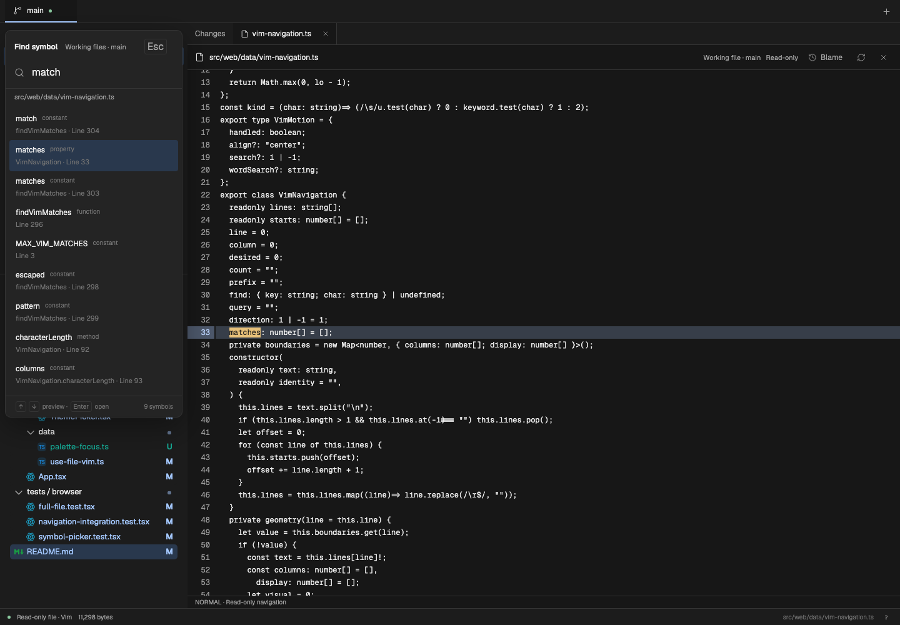

# Using med

[Back to the overview](../README.md).

## Setup

Use an existing checkout of this project. Install Git and Node **22.12 or newer**; Node 24 LTS is used for validation. Supported targets are macOS and Omarchy Linux. The npm package is not published yet.

```sh
npm ci
bun run build
node dist/cli.js /path/to/repository
```

The command starts a local server on port **4173** and opens a private browser URL. Use `--port` to choose another port; med reports an error if that port is occupied. Keep the terminal open. Use `Ctrl+C` to stop it.

```sh
# Choose another fixed local port.
node dist/cli.js /path/to/repository --port 4174

# Print the URL without opening the browser.
node dist/cli.js /path/to/repository --no-open
```

To have an agent set it up, give it this instruction:

> Set up med from this checkout for macOS or Omarchy. Check Git and Node, install the project dependencies, build it, and open it against my chosen repository. Set up the optional Zoekt search helper if Go is available. Report the local URL and any missing prerequisite. Do not run code from the repository being reviewed.

### Multiple repositories

```sh
node dist/cli.js /path/to/frontend /path/to/backend
# Development:
bun run dev -- /path/to/frontend /path/to/backend
```

Use **Open branch** (`+`) to search the registered repositories' branches and worktrees. The picker shows repository groups and worktree paths. Add another repository by entering its local path in the picker. Remove a repository there to close its views and release its resources; this does not delete files or Git branches.

Opening the launch URL starts with only the selected branch or worktree tab. Open additional tabs from **Open branch**. Branch tabs can belong to different repositories. Repository labels distinguish matching branch names. Each tab keeps its comparison and file navigation for the current browser session. The history, files, content search, and symbols all use that tab's repository and branch or worktree. Content search still reads committed content.

Linked worktrees belong to one repository entry. Separate clones remain separate entries, even when they use the same remote. Repository registration lasts for the local server session; restart with the paths you want to use. Patch and file-pair inputs remain separate launch modes.

### Saved agent reviews

An agent can use the running host to save a commit range or capture working changes, then return a clean local review link. Open the launch URL once in the browser to authorize access. Saved links in that browser then use the same local session.

A saved review opens its first target. Select other repositories or ranges from **Review target**. The saved diff and comment context stay fixed even when agents make more changes. **Copy comments** includes comments from all targets in that review, with repository paths, revisions, line numbers, selected source, and adjacent lines. Open **Review** for details. **Clear**, next to **Copy comments**, clears only that review after confirmation. Copying does not clear comments.

Saved reviews and their comments persist in `~/.local/state/med`. Normal branch review notes still end with the host process. See [agent integration](AGENT_INTEGRATION.md) for commands, state settings, limits, and suggested `AGENTS.md` guidance.

Review endpoints can be branch names: `review create --repo /path/to/feature-worktree --base main --head HEAD`. This compares the tips directly and saves their exact commits. Use the common ancestor for a pull-request-style diff, and create a new link after merging the base branch. See [branch comparisons](AGENT_INTEGRATION.md#compare-with-a-base-branch) for commands. In the app, **Compare revisions…** accepts the same refs.

### Indexed branch search

Set up the optional [Zoekt](https://github.com/sourcegraph/zoekt) search helper once. This command builds pinned binaries and saves them in the user cache:

```sh
node dist/cli.js --setup-search
# After installing the package: med-diff --setup-search
```

Setup needs Go. If it is missing, install it with `brew install go` on macOS or `sudo pacman -S go` on Omarchy, then repeat the command. Normal use needs only the compiled binaries, not Go. There is no Docker container, system service, or Git hook to install.

Start med as usual. The first content or project-symbol search starts that repository's search service and builds its index in the background when the helper is installed. Listing repositories does not start indexing. **Content search reads committed branch content** and opens results from the exact commit shown in the picker. Unsaved, uncommitted, and untracked content is not included. The file-name picker and Files sidebar still browse the current worktree.

Active search services check branch commit IDs when repository watchers report changes, with a 10-second poll as a backup. New commits trigger incremental index builds. Adding or deleting an indexed branch triggers a full rebuild. Index builds share one queue across repositories. Up to 64 local branch tips are indexed per repository, with branches used by worktrees given priority. At most four search services remain active; an idle service can close and restart when needed. Its disk cache remains available.

If the helper is missing, the index is rebuilding, or indexing fails, search falls back to Git against the same committed content. Historical commits outside the index also use Git. You can use the app during the initial build.

The default cache is `~/.cache/med/search`, or `$XDG_CACHE_HOME/med/search` when set. Use `MED_SEARCH_CACHE` to choose another location. For an existing helper build, set `MED_ZOEKT_BIN` to the directory containing both `zoekt-git-index` and `med-zoekt`.

The [integration report](validation/ZOEKT_INTEGRATION.md) includes a search screenshot, data flow, checks, and built-host API timings. The [engine benchmark](validation/ZOEKT.md) records index costs and a ten-branch workload. These measurements exclude browser rendering.

### Other inputs

```sh
node dist/cli.js --patch change.patch
git diff | node dist/cli.js --patch -
node dist/cli.js --files old.ts new.ts
```

To check the packaged launch path locally:

```sh
npm pack
npx --yes --package ./med-diff-0.1.0.tgz med-diff /path/to/repository
bunx --package ./med-diff-0.1.0.tgz med-diff /path/to/repository
```

The executable uses Node, including when launched through `bunx`. The package serves compiled assets; it does not need a Vite development server.

## First review

1. Select a commit in the left history panel, or select working changes. Commit diffs compare with the first parent; merge commits are labeled accordingly.
2. Select a changed path to move to it in the diff stream. Double-click the path to open its current file in the selected worktree.
3. Use the top branch tabs or `+` to select another branch. A branch with a worktree opens that directory; a branch without one opens committed content.
4. Use the file picker or right Files sidebar to open unchanged files. A preview does not replace your current review until you open it.
5. Toggle blame in a full file to show author and commit details beside the line numbers. Visible lines preload in the background after a file opens. Toggling blame reuses this cache. Hover a label for 250 ms to see the date and commit message; move to nearby labels for immediate updates. Open the command palette to change theme or find other actions.

Drag the gutter **+** across lines to start a note for the whole range. You can also drag over line numbers, or click the first number and Shift-click the last number on the same diff side, then click **Add note**. The saved comment keeps the full range.

Shift-click another commit to select an inclusive range. The comparison runs from the oldest selected commit's first parent to the newest selected commit. A root commit uses the empty tree. This compares endpoint snapshots; it does not add individual patches across merged branches. Shift+Up/Down extends the selection; a plain click resets it.

| Action                            | macOS        | Omarchy Linux             |
| --------------------------------- | ------------ | ------------------------- |
| All commands and shortcuts        | `?`          | `?`                       |
| Command palette                   | `⌘K`         | `Ctrl+K`                  |
| Find a file                       | `⌘⇧K`        | `Ctrl+Shift+K`            |
| Symbols in current file           | `⌘O`         | `Ctrl+O`                  |
| Symbols in project commits        | `⌘⇧O`        | `Ctrl+Shift+O`            |
| Search file contents              | `⌘⇧F`        | `Ctrl+Shift+F`            |
| Toggle left / right sidebar       | `⌘B` / `⌘⇧B` | `Ctrl+B` / `Ctrl+Shift+B` |
| Resume search                     | `⌥R`         | `Alt+R`                   |
| Keep preview tab                  | `⌥P`         | `Alt+P`                   |
| Toggle gutter blame               | `⌥B`         | `Alt+B`                   |
| Close current file                | `⌥W`         | `Alt+W`                   |
| Close all files in this workspace | `⌥⇧W`        | `Alt+Shift+W`             |
| Close other files                 | `⌥⇧O`        | `Alt+Shift+O`             |

Close actions preserve the Changes tab and other workspaces. Desktop or browser shortcuts can take priority over a web app; the command palette provides the same actions.

## Symbols and Vim navigation

Command-click a diff filename or a file in the Changes list to open a pinned background tab without leaving Changes. Use Ctrl-click on Linux. Closing the active file selects the file to its right, then its left; Changes is selected only when no files remain.



In-file symbol search (`⌘O`) opens a narrow palette over the left sidebar. It starts with the symbol nearest to the cursor. Typed matches keep name relevance first, then use cursor distance to break ties. Arrow keys jump in the current file and highlight the symbol name. Enter keeps that position; Escape restores the original cursor and scroll position. Project symbol search (`⌘⇧O`) keeps a separate file preview and searches the selected repository’s indexed commit. Both palettes retain and select the last query.

Symbol extraction uses Universal Ctags. Install it with `brew install universal-ctags` on macOS or `sudo pacman -S ctags` on Omarchy. The project index and individual file extraction share this binary. Project symbols require the optional Zoekt setup above. After updating from a text-only search build, run `node dist/cli.js --setup-search` again to install the updated helper. Existing text-only indexes rebuild when symbol extraction is enabled. Language coverage follows the installed Ctags parsers: Universal Ctags 6.2.1 covers TypeScript and C/C++, but does not include a Zig parser. Text search still works for Zig.

Vim navigation is enabled by default. Use the command palette to disable or enable it. This preference is saved for the current browser address. Files take keyboard focus when opened, ready for normal-mode navigation:

- `h j k l`, `w b e`, `0 ^ $`, and counts such as `10j`.
- `v` selects characters; `V` selects whole lines. Use motions to extend the selection, `o` to move to the other end, `y` to copy, and Escape to cancel. Selection and copy include source lines outside the visible view.
- `viw` selects a word or punctuation group; `vaw` includes adjacent spaces. `viW` / `vaW` select a non-space WORD, including its punctuation. `v2iw` selects the word and the next space group; `v2aw` selects two words.
- `vip` selects the current paragraph; `vap` includes the adjacent empty lines. Empty lines separate paragraphs; a line with only spaces stays in its paragraph. `v2ap` selects two paragraphs. Repeat `ip` or `ap` in visual mode to extend the selection.
- `vi"` / `va"`, `vi'` / `va'`, and backtick objects select quoted text on the current line. Inner objects omit the quotes; around objects include the quotes and adjacent spaces. Escaped quotes stay inside the selection.
- `vi(` / `va(`, `vi[` / `va[`, and `vi{` / `va{` select nested bracket contents or the whole pair across lines. Closing brackets work too; `ib` / `ab` are parentheses and `iB` / `aB` are braces. A count such as `v2i(` selects the next outer pair. Repeat the object to expand outward. These are lexical pairs; they do not parse language syntax.
- `gd` finds declarations for the identifier at the cursor. It first checks the current file with Universal Ctags, then the ctags-backed project index. Multiple candidates open a picker; project results open their indexed commit. Ctags does not resolve types or imports like an LSP.
- `gg`, `G`, `42G`, `{` / `}` for paragraphs, and `Ctrl+D` / `Ctrl+U` for half pages.
- `''` returns to the previous jump's line at its first non-space character; double backtick returns to the exact column. Repeating either swaps between the two locations. Line-number jumps, file/paragraph jumps, search matches, and accepted in-file symbol/definition jumps record the origin. Cancelled previews do not.
- `ma` through `mz` set local marks; `'a` goes to mark a's line and backtick followed by `a` goes to its exact position. Marks and jump-back are local to the current loaded file snapshot. They reset when the file changes or is reloaded; cross-file jump history and persistent marks are not included.
- `f` / `F` / `t` / `T` followed by a character, `;` / `,` to repeat, and `Shift+A` to move to the end of the line.
- `:123` then Enter to jump to line 123. Escape cancels; a number past the end goes to the last line.
- `zz` / `zt` / `zb` to place the current line at the middle / top / bottom of the view. These keep the cursor column. `zt` and `zb` leave four lines of space from the edge.
- `/` / `?` for live forward/backward file search, `n` / `N` for matches, and `*` / `#` for the word at the cursor. Lowercase queries ignore case; uppercase letters enable case-sensitive matching. The current match uses the theme accent and an underline; other matches use the search color. Enter accepts the preview. Escape cancels a preview and clears highlights; in normal mode it clears highlights while keeping the search.

Browsing starts read-only. Choose **Edit** for a working-tree file, or press `i` with Vim navigation enabled. While a Vim file pane has focus, `?` searches backward; `⌘K` / `Ctrl+K` still opens commands. Palettes and text inputs keep their normal keyboard behavior. Symbol search does not require Vim mode.

## Edit working files

Choose **Edit** to open a file in Vim Normal mode. With Vim navigation enabled,
press `i` in the read-only file pane to enter Insert mode at the current cursor.
Use `i`, `a`, `o`, `dd`, `ciw`, visual selections, `p`, `.`, `u`, and Ctrl+R.
Escape returns to Normal mode. `:w`, ⌘S / Ctrl+S, or **Save** writes the file.
`:wq` saves and returns to viewing only if the save succeeds.

A hollow dot means saved. A filled dot means the draft differs from the last
saved contents. Dirty tabs also show a dot. Undo after saving can make the file
dirty again. **Done** / `:q` returns to viewing; unsaved text requires an explicit
**Discard draft** or **Keep editing** choice. Saving does not stage or commit.

Drafts and undo history stay in memory across tab switches and tab closes. Open
the same working file to resume. Up to 24 drafts are retained; clean drafts can
be evicted at that limit. Reloading or closing the browser warns about unsaved
work but does not persist drafts. Vim starts in Normal mode when reattached.

If an agent or another process changed the file, saving reports a conflict and
keeps your draft. Copy any text you need before discarding and reopening the
current disk version. There is no force-save command. Files from commits and
saved review snapshots remain read-only; open the working-tree version to edit.
Editing is limited to existing, complete UTF-8 text files up to 1 MiB. Symlinks,
hard-linked files, and paths through nested repositories cannot be saved.
Uniform CRLF line endings and ordinary executable permission bits are preserved.

To link directly to a registered working file, URL-encode the canonical worktree
path and repository-relative file path:

```text
http://127.0.0.1:4173/file?repo=%2Fpath%2Fto%2Frepo&path=src%2Fexample.ts&edit=1
```

Omit `edit=1` to open the read-only viewer. The browser must already be authorized
with the host's launch URL, as for saved review links. A file link opens live
working content; it does not freeze a review or register another repository.

## Development

med lives in `apps/med`. Install dependencies from the Workbench root with `bun install --frozen-lockfile`. The commands below run from `apps/med`; root shortcuts include `bun run dev:med`, `bun run build:med`, and `bun run check:med`.

```sh
bun run dev -- /path/to/repository
```

Open the Vite URL with the `#token=…` fragment printed by the API host. Vite proxies API requests to that host. Production builds need no proxy.

Run the complete check from the Workbench root:

```sh
bun run check:med
```

For a focused run, use `bun run test:med` for host integrations, browser tests,
and remaining unit regressions. `bun run --cwd apps/med test:e2e` builds med and
exercises the real CLI and browser with temporary repositories. See
[test design and coverage boundaries](TESTING.md) before adding tests.

The UI uses React, [Pierre Diffs and Trees](https://pierre.computer/), Base UI, and StyleX. Vite 8 uses Rolldown and Oxc; Oxlint, Oxfmt, and Vitest provide checks. Zod validates the host protocol. [Architecture](../ARCHITECTURE.md) describes the boundaries and data flow.

## Limits and evidence

Syntax highlighting uses Twinkleplop. This build includes JavaScript/JSX, TypeScript/TSX, CSS, HTML, JSON/JSONC, Markdown, YAML, TOML, Bash, Go, Python, Rust, SQL, Svelte, diff, INI, HTTP, dotenv, and shell-session grammars. Markdown code fences use the matching installed grammar. C, C++, Zig, and other missing grammars display as plain text; files, diffs, selection, and comments still work. Syntax colours can differ from Shiki because semantic token kinds do not contain full TextMate scope stacks.

Binary files and files with unsupported encodings show metadata only. Text above 8 MiB, 200,000 lines, or 250,000 characters on one line is not rendered. Large supported text uses plain rendering. File manifests stop at 50,000 entries. Missing files are shown as missing; historical content is not silently substituted. See [file browsing](FILE_BROWSING.md) for details.

History follows the selected worktree's HEAD ancestry. Shallow clones can lack the parent needed for a comparison. Blame has the same history limit and is unavailable for files without history or files that require Git content conversion.

This is a browser app backed by a local server. Native desktop packaging, shared persistent review notes, and complete Hunk feature parity are not implemented.

- [Search, definitions, commit ranges, and gutter blame](validation/REVIEW_NAVIGATION.md)
- [Hover prefetch, compact UI, and render diagnostics](validation/HOVER_AND_RENDERING.md)
- [Navigation validation and screenshots](validation/NAVIGATION.md)
- [Zoekt benchmark: setup cost, search latency, and reproducible harness](validation/ZOEKT.md)
- [Twinkleplop integration and timed comparison videos](validation/HIGHLIGHTER_INTEGRATION.md)
- [Baseline diff performance](validation/RESULTS.md)
- [Theme and workspace validation](validation/UI_UPDATE.md)
- [Feature status and navigation behavior](SNACKS_REVIEW.md)

Hunk's retained semantic source and tests carry their original [MIT notice](../upstream/HUNK-LICENSE). [Source provenance](../upstream/HUNK.md) records the pinned revision and adaptations.

Symbol and navigation validation: [Ctags and Zoekt benchmarks](validation/SYMBOL_SEARCH.md), [Vim cursor benchmarks](validation/VIM_NAVIGATION.md), [file symbol palette](validation/file-symbols.png), [Vim file search](validation/vim-navigation.png).

## Standalone files and dropped previews

Open **Open standalone file** from the command palette, or visit `/files` on the
running host. Paste an absolute file path to open a tab. The file does not need
to belong to a Git repository. **Edit**, Vim commands, the saved-state dot, and
conflict-checked saves work as they do for working files. Both file toolbars are
32 px high, so entering or leaving Edit does not move the content boundary.

To start a file workspace from a directory without Git:

```sh
bun run --cwd apps/med build
node apps/med/dist/cli.js --editor
```

An agent can print a link through the running host:

```sh
node /path/to/workbench/apps/med/dist/cli.js open /absolute/path/Example.java --line 42 --column 8
```

Add `--edit` to start in the editor. `--port` and `--state-dir` select the same
connection as review commands. The command prints a token-free Markdown link:
`http://127.0.0.1:4173/file/absolute/path/Example.java?line=42&column=8`.
The browser must first open the host's launch URL. **Copy link** is also available
in the standalone file tabs. These links read the current file, not a snapshot.
Paths are URL-encoded; the CLI handles spaces, Unicode, `#`, and other characters.
Opening one file grants host access to that exact file, not its parent directory.
The host retains at most 256 standalone file grants until restart.

Drop text files anywhere in med to open read-only previews. Dropped bytes stay in
the browser. They have no Edit or Save control, disk path, or agent link. Drop up
to 12 files / 24 MiB at once; the workspace holds at most 24 files / 32 MiB.
Individual previews remain limited to 8 MiB of UTF-8 text; editing is limited to
1 MiB. Binary files and folders are not supported by drop previews. Use the path
field to edit a file on disk. Drafts and drop previews do not survive page reload.

## Full-file change markers

When opening a full file from a diff, the line-number gutter shows green bars
for added lines and red bars for deleted lines in the before version. A deletion
with no remaining row appears as a red tick at its gap in the after version.
Amber bars identify working-file additions and replacements. The header has a
compact color legend; each marker identifies its comparison on hover.

Markers use the selected comparison only when its captured text matches the
file being viewed. If live working content differs from that snapshot, markers
show changes against HEAD instead. **Open before** and **Open after** show the
exact commit versions. Markers are removed from stale views until refresh;
line numbers from an older snapshot are not applied to new content.
