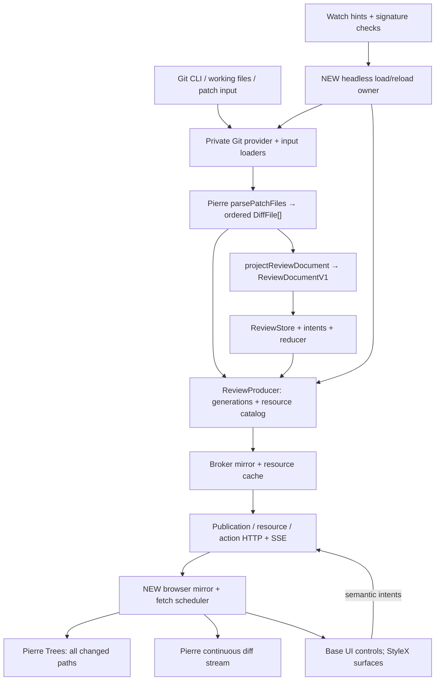

# Hunk core, Git, and data-flow audit

Audit date: 2026-09-19. Source: `modem-dev/hunk`, pinned commit [`9b95a71b76c472bad21ffa5cc6b01b204e2f6f7a`](https://github.com/modem-dev/hunk/tree/9b95a71b76c472bad21ffa5cc6b01b204e2f6f7a). The application manifest says `hunkdiff` 0.22.0. This audit inspected source and tests. It did not install dependencies, run upstream scripts, execute the tests, or benchmark the application. A test listed here is evidence of intended coverage, not a passing result from this audit.

## Recommendation

Use Hunk's existing review model and protocol as the starting point for a source port. Build the Vite browser renderer around that model. Do not start a second Git-to-browser protocol or copy terminal rendering into React DOM.

The pinned source already contains much of the proposed server architecture: normalized reviews, a framework-free state store, semantic actions, generation ordering, source resources, bounded caches, capability-authenticated HTTP, and SSE. It does **not** contain a working browser review application. Upstream explicitly lists browser rendering, browser actions, browser packaging, and browser launch commands as unfinished. Its website is a separate documentation/product site. [Upstream rebuild status](https://github.com/modem-dev/hunk/blob/9b95a71b76c472bad21ffa5cc6b01b204e2f6f7a/docs/browser-review-rebuild.md#L1-L14).

This is source reuse, not importing a published headless SDK. `hunkdiff` publishes CLI entry points and `./extension` and `./opentui` facades. It does not export its review core. The VCS and broker workspaces are private. Keep the upstream commit, license, source mapping, and local changes recorded if we vendor or fork these files. [Published exports](https://github.com/modem-dev/hunk/blob/9b95a71b76c472bad21ffa5cc6b01b204e2f6f7a/packages/hunk/package.json#L22-L54), [private Git package](https://github.com/modem-dev/hunk/blob/9b95a71b76c472bad21ffa5cc6b01b204e2f6f7a/packages/hunk-git/package.json#L1-L26).

The repository license is MIT, copyright Modem Labs Inc.; copied substantial source must retain its copyright and permission notice. This does not grant rights to product names or imply that third-party dependencies have the same license. [License](https://github.com/modem-dev/hunk/blob/9b95a71b76c472bad21ffa5cc6b01b204e2f6f7a/LICENSE#L1-L21).

## Actual flow and the new host boundary

The important extraction is ownership of live review state. `ReviewProducer` publishes immutable generations but explicitly does not own live state; it attaches to the store that the terminal controller currently owns. `createReviewSessionRuntime` starts the producer and broker client but is not a complete standalone review host. Our headless host must own initial loading, store creation, reload serialization, generation publication, disposal, and cancellation. Preserve upstream prepare/reserve/commit ordering; do not publish new content while the store still describes the previous generation. [Producer](https://github.com/modem-dev/hunk/blob/9b95a71b76c472bad21ffa5cc6b01b204e2f6f7a/packages/hunk/src/app/review/producer.ts#L1-L43), [session runtime](https://github.com/modem-dev/hunk/blob/9b95a71b76c472bad21ffa5cc6b01b204e2f6f7a/packages/hunk/src/app/session/reviewRuntime.ts#L1-L50).

A full Hunk-compatible host retains the daemon and session channel for agents and multiple surfaces. A single-process host can later call producer operations directly, but must preserve the same review contracts. That is a deployment change to verify, not a reason to rewrite semantic behavior now.

## Reuse, adapt, and replace

| Source area                                                                          | Decision    | Required work and tests to carry                                                                                                                                                                   |
| ------------------------------------------------------------------------------------ | ----------- | -------------------------------------------------------------------------------------------------------------------------------------------------------------------------------------------------- |
| `core/review/{types,document,identity,geometry,expansion,anchors}`                   | Reuse       | Ordered JSON-safe files, side-specific ranges, gaps, note ownership, content/source identity. Carry colocated tests and `test/review-conformance/`.                                                |
| `core/review/{state,actions,reducer,store,intents,selectors,navigation}`             | Reuse       | Framework-free semantic state. Use React's external-store subscription support; no new general state library is required. Keep DOM scrolling, measured heights, theme and panel widths outside it. |
| `core/review/{generationOrder,resources,resourceAssembly,contentManifest}`           | Reuse       | Keep stale-publication rejection, byte ranges, digest checks and resource limits. Register the browser projection in the existing conformance corpus.                                              |
| `session/{reviewProtocol,reviewHttpProtocol,reviewEventProtocol,reviewErrorCatalog}` | Reuse       | These are explicitly browser-safe contracts. Do not duplicate event names, action schemas, or ordering rules in the client.                                                                        |
| `app/review/{producer,publication,resourceStore}`                                    | Adapt       | Move store/load/reload ownership into a headless host. Keep publication and resource tests; add host lifecycle tests. These modules are server-side, not browser imports.                          |
| `session/broker/{browserReviewServer,reviewMirror,reviewResourceCache}`              | Adapt       | Keep auth, origin rules, HTTP range/error semantics and cache tests. Add Vite-built asset serving separately: current API responses use `default-src 'none'` because they serve no HTML.           |
| `hunk-git/src/{commands,index,source,history}` and `hunk-vcs/src/*`                  | Adapt       | Preserve Git command semantics and parsing tests; replace Bun runtime calls for a Node-compatible host. Add explicit repository/worktree discovery and switching of review targets.                |
| `core/watch/{controller,plan,observer,portableTree,signature}`                       | Adapt       | Reuse controller state machine; keep watcher backend isolated. Measure signature cost before making changes. Carry startup, burst, close, retry, resource exhaustion and filesystem tests.         |
| `core/changeset/{loaders,fromPatch,diffFile}` and `extensions/vcsPatchResult`        | Adapt       | Keep input normalization and binary/untracked handling. Separate reusable projection from Bun file/config/language lookup dependencies. Do not import the whole loader graph into the browser.     |
| Terminal `ui/App*`, rows, cell widths, scroll boxes, drawing and OpenTUI bindings    | Replace     | Build React DOM components. Reuse semantic selectors through an adapter, not terminal pixel/cell calculations.                                                                                     |
| Full extension host, updater, terminal pager, installer, session CLI                 | Conditional | Preserve only if their product behavior is in the agreed parity baseline; never bundle them into the browser.                                                                                      |

The explicit browser import-boundary test covers the review core plus the four session contract modules. It follows value imports and distinguishes erased type imports. This is stronger evidence than a directory named `core`. `core` also contains Node/Bun process, file and configuration code, so that entire directory is **not** browser-safe. [Boundary declarations](https://github.com/modem-dev/hunk/blob/9b95a71b76c472bad21ffa5cc6b01b204e2f6f7a/scripts/quality/source-boundaries.test.ts#L34-L62), [store](https://github.com/modem-dev/hunk/blob/9b95a71b76c472bad21ffa5cc6b01b204e2f6f7a/packages/hunk/src/core/review/store.ts#L1-L56), [review model](https://github.com/modem-dev/hunk/blob/9b95a71b76c472bad21ffa5cc6b01b204e2f6f7a/packages/hunk/src/core/review/types.ts#L1-L207).

## Git queries and worktrees

The current Git adapter uses the Git executable, not libgit2. A working-tree load resolves the repository and comparison, runs `git diff --numstat -z`, reads moved-line configuration, builds source capability information, discovers untracked files, and then runs the patch-producing diff. It excludes selected large files and returns placeholders. Untracked files are discovered in one status call and synthesized in-process, avoiding a subprocess for every untracked path. [Load implementation](https://github.com/modem-dev/hunk/blob/9b95a71b76c472bad21ffa5cc6b01b204e2f6f7a/packages/hunk-git/src/index.ts#L377-L507).

Keep the defensive details: argument arrays, rejection of option-like revisions, `--` before user pathspecs, `--no-ext-diff`, fixed `a/` and `b/` prefixes, and byte-safe path quoting. These are correctness constraints, not incidental CLI formatting. Hunk uses rename detection, so rename-heavy reviews can cost more than simple comparisons. [Command construction](https://github.com/modem-dev/hunk/blob/9b95a71b76c472bad21ffa5cc6b01b204e2f6f7a/packages/hunk-git/src/commands.ts#L56-L214).

File sources currently use `git show <ref>:<path>`, `git show :<path>`, or a filesystem read. Each source side has a per-file cache. This is a clear place to later evaluate persistent `git cat-file --batch` access; it is not already implemented here. Keep the Git CLI first, then optimize measured subprocess overhead before adding libgit2/native bindings. [Source reader](https://github.com/modem-dev/hunk/blob/9b95a71b76c472bad21ffa5cc6b01b204e2f6f7a/packages/hunk-git/src/source.ts#L71-L157), [source wrapper cache](https://github.com/modem-dev/hunk/blob/9b95a71b76c472bad21ffa5cc6b01b204e2f6f7a/packages/hunk/src/extensions/vcsPatchResult.ts#L35-L95).

Linked worktrees are already recognized for watching: Hunk resolves both the per-worktree Git directory and the common directory; it watches metadata while excluding Git object storage. A live working-tree endpoint also watches the checkout, with ignored directories pruned. Commit-to-commit review avoids watching the whole working directory. Carry the linked-worktree regression test. No worktree-list/picker implementation was found in the inspected Git adapter/app/core paths; this audit does not claim Hunk has a worktree switching UI. [Watch plan](https://github.com/modem-dev/hunk/blob/9b95a71b76c472bad21ffa5cc6b01b204e2f6f7a/packages/hunk-git/src/index.ts#L273-L328), [metadata resolution](https://github.com/modem-dev/hunk/blob/9b95a71b76c472bad21ffa5cc6b01b204e2f6f7a/packages/hunk-git/src/commands.ts#L831-L856), [linked-worktree test](https://github.com/modem-dev/hunk/blob/9b95a71b76c472bad21ffa5cc6b01b204e2f6f7a/packages/hunk-git/src/index.test.ts#L450-L482).

## Invalidation, costs, and correctness gates

The watch controller coalesces hints with a 200 ms quiet delay and a 1 s maximum delay. It performs a safety signature check every 10 s when healthy, or every 2 s when degraded. It serializes checks and refreshes, remembers an event received during a refresh, checks on watcher readiness, and cancels in-flight signature work on close. The observer uses native recursive watching on macOS/Windows and a portable Chokidar tree implementation elsewhere. [Controller](https://github.com/modem-dev/hunk/blob/9b95a71b76c472bad21ffa5cc6b01b204e2f6f7a/packages/hunk/src/core/watch/controller.ts#L99-L122), [observer](https://github.com/modem-dev/hunk/blob/9b95a71b76c472bad21ffa5cc6b01b204e2f6f7a/packages/hunk/src/core/watch/observer.ts#L1-L216).

The signature is not a cheap metadata-only query. For working changes it generates the tracked patch, resolves the root, lists untracked files, and appends file stat signatures. A changed signature then triggers a load which computes the patch again. Startup may also compute a signature before loading. Do not describe this as incremental per-file Git invalidation. It is robust whole-review reconciliation with repeated Git work. [Signature](https://github.com/modem-dev/hunk/blob/9b95a71b76c472bad21ffa5cc6b01b204e2f6f7a/packages/hunk-git/src/index.ts#L489-L521), [bootstrap baseline](https://github.com/modem-dev/hunk/blob/9b95a71b76c472bad21ffa5cc6b01b204e2f6f7a/packages/hunk/src/core/changeset/loaders.ts#L280-L300).

The following items need targeted tests or measurements before we claim performance parity:

- **Initial work is eager on the host.** The Git provider generates a complete patch and `changesetFromPatch` parses the entire result. Browser lazy resource loading reduces transfer/render work, but does not by itself make initial Git and host parsing lazy. [Parser](https://github.com/modem-dev/hunk/blob/9b95a71b76c472bad21ffa5cc6b01b204e2f6f7a/packages/hunk/src/core/changeset/fromPatch.ts#L135-L200).
- **The generic process helper collects whole stdout/stderr strings.** Cancellation and process cleanup exist, but there is no byte limit in that helper. Huge signature or patch output can still consume memory before downstream resource limits apply. [Process helper](https://github.com/modem-dev/hunk/blob/9b95a71b76c472bad21ffa5cc6b01b204e2f6f7a/packages/hunk-vcs/src/async-process.ts#L11-L110).
- **`--numstat` is less output, not free diff computation.** It also uses rename detection. Large-file rules use 1,000,000 bytes or 20,000 changed lines. The numstat parser explicitly handles normal entries; tests should cover NUL-separated renames and filenames with tabs before using this as a universal resource limit. Historical file size also cannot be established by stat-ing the current checkout. [Numstat and skip checks](https://github.com/modem-dev/hunk/blob/9b95a71b76c472bad21ffa5cc6b01b204e2f6f7a/packages/hunk-git/src/commands.ts#L194-L241), [thresholds](https://github.com/modem-dev/hunk/blob/9b95a71b76c472bad21ffa5cc6b01b204e2f6f7a/packages/hunk-vcs/src/large-file.ts#L1-L17).
- **Live source reads are not frozen filesystem snapshots.** Commit endpoints can be pinned, and the index cache key hashes `ls-files --stage -z`; however later context reads still read `:path` or the live working file. Exercise save/stage races between patch load and first context expansion, plus changes outside the visible patch. A generation/digest protects transfer integrity; it does not prove that delayed source bytes belonged to the original Git comparison. The reviewed tests cover stable reloads and index-key changes, not an exhaustive race proof. [Source capability](https://github.com/modem-dev/hunk/blob/9b95a71b76c472bad21ffa5cc6b01b204e2f6f7a/packages/hunk-git/src/index.ts#L123-L241), [source identity](https://github.com/modem-dev/hunk/blob/9b95a71b76c472bad21ffa5cc6b01b204e2f6f7a/packages/hunk/src/core/review/identity.ts#L117-L138), [existing source tests](https://github.com/modem-dev/hunk/blob/9b95a71b76c472bad21ffa5cc6b01b204e2f6f7a/packages/hunk-git/src/index.test.ts#L151-L198).
- **Cache byte limits are not a total process memory limit.** The broker bounds completed bytes to 64 MiB, in-flight bytes to 32 MiB and concurrent assemblies to eight. Parsed host documents, patch strings, per-file source caches, browser models and highlighting workers are separate allocations. [Broker limits](https://github.com/modem-dev/hunk/blob/9b95a71b76c472bad21ffa5cc6b01b204e2f6f7a/packages/hunk/src/session/broker/reviewResourceCache.ts#L1-L39).

Suggested measurements: cold open, warm reopen, one-file save, rename-heavy review, large generated file, thousands of small files, deep ignored trees, worktree switch, and watch failure/recovery. Record Git subprocess count/time, parse time, bytes retained, time until the first useful diff, scroll responsiveness, and refresh stability. No timings are claimed here.

## Transport and protocol limits

The existing HTTP surface has four functions per live session: get publication, read a resource, stream changes, and submit a semantic action. A session creates a capability; the daemon receives only its digest. Requests present the capability in a header, and the planned opener keeps it in a URL fragment. The API is same-origin and does not enable CORS. The browser must read SSE through `fetch`, since the native `EventSource` API cannot attach this capability header. Keep one reconnect scheduler and reject superseded resource loads. [HTTP design](https://github.com/modem-dev/hunk/blob/9b95a71b76c472bad21ffa5cc6b01b204e2f6f7a/packages/hunk/src/session/broker/browserReviewServer.ts#L1-L41), [upstream remaining browser work](https://github.com/modem-dev/hunk/blob/9b95a71b76c472bad21ffa5cc6b01b204e2f6f7a/docs/browser-review-rebuild.md#L90-L117).

This is versioned internal machinery, not a promise of a stable third-party SDK. At the pin, the review protocol version is 1 and the built daemon/session version is 15. Hunk requires an exact daemon/session match and has wire fixtures to detect payload changes. A source port should use its own app/daemon identity and isolated credentials/paths, so it does not accidentally register with or replace the user's normal Hunk daemon. [Version constants](https://github.com/modem-dev/hunk/blob/9b95a71b76c472bad21ffa5cc6b01b204e2f6f7a/packages/hunk/src/session/protocol.ts#L32-L61), [review protocol](https://github.com/modem-dev/hunk/blob/9b95a71b76c472bad21ffa5cc6b01b204e2f6f7a/packages/hunk/src/session/reviewProtocol.ts#L60-L76).

Semantic actions can be reused; host-only actions cannot be exposed blindly. Editing in an external editor, invoking extensions, or quitting the process need an explicit host capability. Client-local settings such as theme and panel width should not become shared review actions. Shared selection across multiple browser/agent clients also needs a product policy. Upstream marks that policy and remote host commands as open scope. [Command ownership](https://github.com/modem-dev/hunk/blob/9b95a71b76c472bad21ffa5cc6b01b204e2f6f7a/docs/browser-review-rebuild.md#L178-L211).

## Bun versus Node

The core review contracts can be shared with the browser. The current Git implementation cannot run unchanged in Node: `hunk-vcs/async-process.ts` calls `Bun.spawn`; Git source reading calls `Bun.spawn`; Git metadata/history helpers call `Bun.spawnSync`; file loaders use `Bun.file`. Configuration, glob matching and parts of CLI startup also use Bun APIs. Declared `node >=22` engines do not establish runtime support for those paths. [Async process](https://github.com/modem-dev/hunk/blob/9b95a71b76c472bad21ffa5cc6b01b204e2f6f7a/packages/hunk-vcs/src/async-process.ts#L11-L35), [sync Git helper](https://github.com/modem-dev/hunk/blob/9b95a71b76c472bad21ffa5cc6b01b204e2f6f7a/packages/hunk-git/src/commands.ts#L470-L496).

Two valid steps are available:

1. **Short parity prototype:** keep a Bun server process, use Vite for the browser, and prove the browser adapter against Hunk's real protocol. This minimizes semantic changes, but does not complete a Node-based `npx` distribution. Hunk's own npm package includes Bun as a dependency.
2. **Preferred distribution target:** create a small host runtime boundary using Node file/process APIs; port the Git/file paths and headless startup; use the existing Node broker adapter. Build the browser with Vite and package prebuilt assets. A Bun launcher may still execute that Node-compatible package. Do not import Bun-specific loaders into browser code.

The listener swap is localized; the complete runtime port is wider. Hunk's application daemon imports the Bun listener explicitly. The generic Node listener already exists, uses `node:http` and `ws`, and has real-Node adapter tests. Changing that import alone does not remove Bun from the producer, Git loader, config, or CLI. [Bun composition](https://github.com/modem-dev/hunk/blob/9b95a71b76c472bad21ffa5cc6b01b204e2f6f7a/packages/hunk/src/session/broker/brokerServer.ts#L1-L13), [Node adapter](https://github.com/modem-dev/hunk/blob/9b95a71b76c472bad21ffa5cc6b01b204e2f6f7a/packages/session-broker-node/src/serve.ts#L1-L38).

## Direct dependency inventory and proposed treatment

This inventory uses manifests at the pin. Workspace links are internal code dependencies, not separate public packages to install. Transitive dependencies need a later lockfile/license review; the following is not a claim that the final dependency tree contains only these names.

| Package                     | Direct runtime dependencies                                                                                                                                  | Proposed treatment                                                                                                                                                     |
| --------------------------- | ------------------------------------------------------------------------------------------------------------------------------------------------------------ | ---------------------------------------------------------------------------------------------------------------------------------------------------------------------- |
| `hunkdiff`                  | `bun ^1.4.2`; `chokidar ^4.0.3`; `commander ^14.0.3`; `diff ^8.0.3`; `get-east-asian-width ^1.5.0`; `shell-quote 1.9.0`; `string-width ^8.2.1`; `zod ~4.4.3` | See decisions below.                                                                                                                                                   |
| `@hunk/vcs`                 | None                                                                                                                                                         | Adapt the built-in runtime calls.                                                                                                                                      |
| `@hunk/git`                 | `@hunk/vcs workspace:*`, `hunkdiff workspace:*`                                                                                                              | Keep source; replace its public-extension import with an explicit retained contract if extracting.                                                                     |
| `@hunk/jj`                  | Same two workspace links                                                                                                                                     | Preserve as optional parity scope; do not delete provider abstractions to make Git simpler.                                                                            |
| `@hunk/sapling`             | Same two workspace links                                                                                                                                     | Preserve as optional parity scope.                                                                                                                                     |
| `@hunk/session-broker-core` | None                                                                                                                                                         | Reuse protocol/state primitives needed by retained broker.                                                                                                             |
| `@hunk/session-broker`      | `@hunk/session-broker-core workspace:*`                                                                                                                      | Reuse if retaining daemon/session behavior. Runtime-neutral here means injected listener/connection interfaces, not that arbitrary server code belongs in the browser. |
| `@hunk/session-broker-node` | `@hunk/session-broker workspace:*`, `ws ^8.18.3`                                                                                                             | Retain `ws` if using the existing producer-to-daemon WebSocket channel on Node. HTTP/SSE to the browser does not remove this channel.                                  |
| `@hunk/session-broker-bun`  | `@hunk/session-broker workspace:*`                                                                                                                           | Prototype or optional Bun host; omit from Node distribution once replaced.                                                                                             |
| `@hunk/term-video`          | None in its manifest                                                                                                                                         | Drop from application runtime; terminal capture tooling is not part of the port.                                                                                       |
| `hunk-release-proxy`        | None; Wrangler/TypeScript/Bun types are dev dependencies                                                                                                     | Upstream release infrastructure; do not port.                                                                                                                          |

Source manifests: [application](https://github.com/modem-dev/hunk/blob/9b95a71b76c472bad21ffa5cc6b01b204e2f6f7a/packages/hunk/package.json#L55-L101), [VCS packages](https://github.com/modem-dev/hunk/tree/9b95a71b76c472bad21ffa5cc6b01b204e2f6f7a/packages), [Node broker](https://github.com/modem-dev/hunk/blob/9b95a71b76c472bad21ffa5cc6b01b204e2f6f7a/packages/session-broker-node/package.json).

| External library                       | Proposed decision                                                                    | Reason                                                                                                                                                                                                                                                                                                                                 |
| -------------------------------------- | ------------------------------------------------------------------------------------ | -------------------------------------------------------------------------------------------------------------------------------------------------------------------------------------------------------------------------------------------------------------------------------------------------------------------------------------- |
| `bun`                                  | Conditional prototype; drop as mandatory runtime for final Node package              | Carrying it keeps the source port easy but ships another runtime. Vite toolchain preference does not require or forbid Bun.                                                                                                                                                                                                            |
| `chokidar`                             | Retain provisionally behind watcher interface                                        | Cross-platform readiness, rename and resource lifecycle behavior is real complexity. Do not replace it with a few `fs.watch` lines merely to reduce the count. Measure and validate native alternatives separately.                                                                                                                    |
| `commander`                            | Drop for a small new launch CLI; conditional for full Hunk CLI parity                | Node `util.parseArgs` can support a narrow launcher. Porting the complete nested CLI/help/error contract without Commander would add avoidable work.                                                                                                                                                                                   |
| `diff`                                 | Conditional                                                                          | Current direct-file comparison uses `createTwoFilesPatch` alongside Pierre parsing. Check whether Pierre's already-transitive diff support can provide the exact behavior before adding a direct dependency or replacing it with Git `--no-index`. A direct dependency is preferable to importing an undeclared transitive dependency. |
| `get-east-asian-width`, `string-width` | Drop from browser application                                                        | They support terminal cell measurement in `ui/lib/text.ts`; browser font metrics replace that model.                                                                                                                                                                                                                                   |
| `shell-quote`                          | Drop unless preserving shell-string pager/editor configuration                       | Existing use is terminal pager parsing. New APIs should pass executable and argument arrays. If retaining string grammar, retain a correct parser rather than splitting on spaces.                                                                                                                                                     |
| `zod`                                  | Retain for full broker/agent parity; reassess only with a narrow protocol extraction | Used in session schema/parser code. Replacing extensive validated schemas increases code and regression risk. Browser review contracts already use their own shared parsers; do not add a second browser schema system.                                                                                                                |
| `ws`                                   | Retain if Node daemon architecture is kept                                           | Required by the existing server-side WebSocket adapter. Native HTTP/SSE does not replace WebSocket server framing.                                                                                                                                                                                                                     |
| OpenTUI peers                          | Drop                                                                                 | Terminal implementation.                                                                                                                                                                                                                                                                                                               |
| React and Pierre Diffs peers           | Retain                                                                               | Browser rendering foundation. Hunk pins Pierre Diffs 1.3.5; verify the chosen browser release against retained model fields.                                                                                                                                                                                                           |
| `@shikijs/themes` dev dependency       | Conditional                                                                          | Hunk uses it for bundled theme generation. Prefer the theme support already provided by Pierre unless custom theme generation needs a direct dependency.                                                                                                                                                                               |

No evidence in this audit requires Hono, TanStack Query, Redux, Zustand, a second virtualizer, a routing framework, or a general event library. Start with the retained protocol/store, Fetch, native HTTP, and explicit small host/browser adapters. Add a library only when it removes a demonstrated maintenance or correctness cost. This is a recommendation for our port, not a claim that Hunk already has all of these adapters.

## Parallel work ownership

Freeze three contracts before wide delegation: (1) the exact shared review/protocol source set, (2) host lifecycle API, and (3) the browser adapter API for file order, selection/reveal, annotations and source expansion.

| Lane                            | Files owned                                                | Can proceed independently after contracts              | Gate                                                                                 |
| ------------------------------- | ---------------------------------------------------------- | ------------------------------------------------------ | ------------------------------------------------------------------------------------ |
| Shared core/protocol extraction | Review core, wire contracts, conformance fixtures          | Yes, using static fixture documents                    | Browser build contains no Node/Bun imports; retained fixtures migrated to Vitest.    |
| Host/runtime                    | Git, process/files, watch, producer/daemon composition     | Yes, serving a fixture client or protocol test harness | Real Node Git/worktree tests, cancellation, save/stage race tests, watcher recovery. |
| Browser data adapter            | HTTP client, SSE reconnect, resource scheduler, mirror     | Yes, against a fake protocol server                    | Stale-generation, out-of-order response, disconnect, bounded cache and retry tests.  |
| Browser surface                 | Pierre stream/tree adapter, Base UI controls, StyleX theme | Yes, against fixture-backed browser adapter            | All-file stream, navigation, notes, expansion and theme proof in a real browser.     |

The coordinator owns dependency/version decisions, source provenance, shared contract changes, build configuration and integration. Do not let several agents edit one manifest or change a shared protocol independently. With four total agent slots, the coordinator can own extraction/contracts while three agents own host, browser data, and browser surface. Integrate a vertical fixture-backed review early, then replace fixture data with the real host. Run heavyweight browser/performance checks serially on one reference build.

Port relevant tests to Vitest; do not carry `bun:test` imports into the new test runner unchanged. Native process and watcher tests still need real temporary Git repositories, and browser integration needs real DOM/worker execution. Upstream PTY tests specify terminal behavior and do not prove browser performance or keyboard behavior.

Suggested review order: recommendation and new host boundary → reuse table → Git/invalidation correctness gates → runtime/dependency decisions → parallel ownership.
