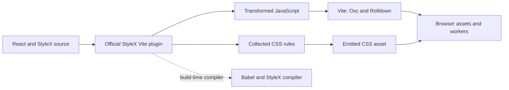

# Tooling and styling audit

Audit date: 2026-09-19. This is a design proposal. No dependencies were installed, no application code was changed, and no compatibility tests were run. The links below were read during this audit. Documentation on `main` and unversioned websites can change; the first implementation task must record exact package versions in the lockfile.

## Recommendation

Use Vite 8, its integrated Rolldown bundler and Oxc transforms, Vitest, Oxlint, Oxfmt, TypeScript, and the official StyleX Vite plugin from the start. Keep build tools out of the published application's runtime path. Use Base UI for controls that need keyboard, focus, popup, or selection behavior. Use Pierre for the tree and diff surfaces. Use platform APIs for small application services.

Two exceptions require explicit treatment:

- StyleX's official compiler still uses Babel. This is a build dependency; it does not mean that the whole application needs a Babel-based build.
- StyleX-specific validation uses its ESLint plugin. Try it through Oxlint's JS-plugin support, but prove compatibility. That support is currently alpha. If it fails, use a small StyleX-only ESLint check until the gap is resolved.

## Verified tooling facts and proposed choices

| Area   | Verified fact                                                       | Proposed choice                                                                                     |
| ------ | ------------------------------------------------------------------- | --------------------------------------------------------------------------------------------------- |
| Build  | Vite 8 is stable and includes Rolldown and Oxc.                     | Use `vite`, not the old `rolldown-vite` preview alias. Do not add a second bundler for the web app. |
| React  | The official React plugin supplies React Fast Refresh.              | Use `@vitejs/plugin-react`; do not add SWC or React Compiler at the start.                          |
| CSS    | StyleX publishes an official Vite adapter in `@stylexjs/unplugin`.  | Use that adapter, before the React plugin.                                                          |
| Lint   | Oxlint supports React, TypeScript, Vitest, and accessibility rules. | Use Oxlint as the main linter. Select correctness rules first.                                      |
| Format | Oxfmt supports a dedicated format check.                            | Use Oxfmt; do not add Prettier.                                                                     |
| Types  | Vite transforms TypeScript without checking types.                  | Keep an explicit type-check command.                                                                |
| Tests  | Vitest supports Node tests and tests in real browsers.              | Use one Vitest configuration with separate Node and browser projects.                               |

Sources: [Vite 8 release](https://vite.dev/blog/announcing-vite8), [React plugin](https://github.com/vitejs/vite-plugin-react/blob/main/packages/plugin-react/README.md), [StyleX Vite guide](https://stylexjs.com/docs/learn/installation/vite/vite-react), [Oxlint](https://oxc.rs/docs/guide/usage/linter), [Oxfmt](https://oxc.rs/docs/guide/usage/formatter.html), [Vite TypeScript support](https://vite.dev/guide/features#typescript), [Vitest Browser Mode](https://vitest.dev/guide/browser/).

Use an explicit Node baseline for development and CI. The current Vitest guide requires Node 22.12 or later. Vite's documented minimum is Node 20.19 or 22.12, depending on the major release. Node 22.12 is therefore the minimum intersection of these published requirements, not proof that every selected dependency works there. Set the actual package engine after the compatibility check. `bunx` launch support and running the entire toolchain under Bun are separate claims. Use `bun run test`, not `bun test`, to invoke a Vitest script. [Vitest requirements](https://vitest.dev/guide/), [Vite requirements](https://vite.dev/guide/).

Vite+ now combines the same tools with a task runner and runtime/package-manager management. It is optional here. Start with the requested tools directly; a small package does not need an additional toolchain management layer. Reconsider Vite+ if it removes measured setup or CI costs. [Vite+](https://viteplus.dev/).

## Dependency budget

These are proposed direct dependencies, not an installed manifest. Transitive dependencies still exist and must be recorded when the lockfile is created. Do not count package names alone as the cost: inspect shipped bytes, native binaries, browser chunks, maintenance, and runtime work.

| Classification            | Package or API                                                            | Reason                                                                                                                           |
| ------------------------- | ------------------------------------------------------------------------- | -------------------------------------------------------------------------------------------------------------------------------- |
| Product runtime           | `react`, `react-dom`                                                      | UI lifecycle, state subscriptions, and compatibility with the selected components.                                               |
| Product runtime           | `@base-ui/react`                                                          | Accessible controls, focus management, and popup behavior.                                                                       |
| Product runtime           | `@pierre/diffs`, `@pierre/trees`                                          | The user-selected core rendering and file-navigation primitives. Exact exports and peer requirements belong to the Pierre audit. |
| Product runtime           | `@stylexjs/stylex`                                                        | Required StyleX runtime; application styles compile to CSS.                                                                      |
| Build                     | `vite`, `@vitejs/plugin-react`                                            | Browser build, workers, development server, and React refresh. Rolldown/Oxc come through Vite.                                   |
| Build                     | `@stylexjs/unplugin`                                                      | Official StyleX transformation and CSS extraction. Resolve its declared peers in the lockfile.                                   |
| Static checks             | `typescript`, `oxlint`, `oxfmt`, relevant `@types/*`                      | Type checks, lint, formatting, and environment types.                                                                            |
| Style checks              | `@stylexjs/eslint-plugin`                                                 | Detect invalid StyleX declarations. Use through Oxlint if the proof check passes.                                                |
| Test                      | `vitest`, `@vitest/browser-playwright` and its required provider packages | Node and real-browser tests. Browser installation is part of CI setup.                                                           |
| Optional test helper      | `vitest-browser-react`                                                    | Add only if repeated mount/cleanup code warrants it.                                                                             |
| Conditional lint fallback | `eslint` plus the minimum required TS parser/config                       | Only if the StyleX plugin does not work correctly under Oxlint.                                                                  |
| Conditional typed lint    | `oxlint-tsgolint`                                                         | Needed for Oxlint's type-aware mode; keep separate from the initial type-check decision.                                         |
| Platform APIs             | Node `http`, `child_process`, `fs`, `path`, `crypto`, `util.parseArgs`    | Initial server, Git execution, content identities, paths, and CLI parsing.                                                       |
| Platform APIs             | `fetch`, `ReadableStream`, `AbortController`, `Worker`, React state APIs  | HTTP, streamed invalidation events with capability-auth request headers, cancellation, worker jobs, and UI state.                |

StyleX requires its runtime package. Its official unplugin package manifest lists Babel core, the StyleX Babel plugin, syntax plugins, and CSS-related dependencies. Do not advertise a Babel-free installation. The `unplugin` peer also needs to be satisfied by the chosen package manager. [StyleX installation](https://stylexjs.com/docs/learn/installation/), [unplugin manifest](https://raw.githubusercontent.com/facebook/stylex/main/packages/%40stylexjs/unplugin/package.json).

Start without Hono/Express, TanStack Query, a router, Zustand/Redux, a generic cache package, a command-palette package, a splitter package, or a second virtualizer. This is a scope decision, not a claim that these packages lack value. Keep the first APIs small. Reconsider a dependency when it replaces a clearly defined body of difficult, tested behavior. Watching across platforms is a likely exception; decide it from the Git/watch audit rather than assuming that raw `fs.watch` is sufficient.

Do not add Shiki directly only to duplicate Pierre's highlighting path. Add it directly only if our code imports its API for a separate, justified feature. The same rule applies to transitive popup or virtualization packages.

## StyleX build path

This is a conceptual flow, not a claim about the exact order of all internal Vite hooks.

Use the documented plugin order: `stylex.vite(...)`, then `react()`. Import a small CSS entry from the app so the build emits a CSS asset. The official guide says that StyleX appends its output to that asset. [StyleX Vite setup](https://stylexjs.com/docs/learn/installation/vite/vite-react).

Development needs the StyleX virtual stylesheet and hot-reload module described by the plugin. Test both adding and removing styles; an initial render alone does not prove CSS invalidation. Use named CSS layers to keep the reset below StyleX. Unlayered CSS has higher cascade priority than layered rules, so third-party CSS requires inspection. [StyleX unplugin options and development modules](https://stylexjs.com/docs/api/configuration/unplugin).

Keep source layout tokens in one exported `*.stylex.ts` module. Use `defineVars` for semantic tokens and `createTheme` for built-in themes. Tokens should describe use: `surface`, `panel`, `border`, `text`, `mutedText`, `focusRing`, `added`, and `removed`. Do not make every component understand a Zed theme file. If theme import is added, one adapter maps external theme values into our token contract. [StyleX variables](https://stylexjs.com/docs/api/javascript/defineVars/), [StyleX themes](https://stylexjs.com/docs/api/javascript/createTheme/).

Pierre's rendering surfaces need their own documented theme interface. Do not assume that application StyleX selectors can reach into a library's shadow root. One application theme selection should produce both shell tokens and the Pierre theme configuration. The integration check must verify that menus, tooltips, tree rows, diffs, and syntax all change together.

## Base UI and styling boundaries

Base UI has no bundled CSS. Its rendered parts accept classes and inline styles, and it exposes component state and CSS variables. StyleX returns props that fit this model. This makes the combination plausible without a separate adapter library; it is not a verified compatibility result yet. [Base UI styling](https://base-ui.com/react/handbook/styling), [StyleX props](https://stylexjs.com/docs/api/javascript/props/).

| Surface                           | Primitive owner                       | What our code adds                                                     |
| --------------------------------- | ------------------------------------- | ---------------------------------------------------------------------- |
| Repository/worktree/branch picker | Base UI Combobox or Select            | Git data, filtering policy, labels, loading and empty states.          |
| View mode and display options     | Base UI Toggle Group, Menu, Switch    | Commands and persisted settings.                                       |
| Command palette                   | Base UI Dialog plus Combobox          | Command registry, ranking, shortcut display, execution.                |
| Context menus and tooltips        | Base UI Context Menu and Tooltip      | File actions and short descriptions.                                   |
| Annotation editor                 | Base UI Dialog/Popover and Field      | Annotation identity, save state, and conflict behavior.                |
| Changed-file tree                 | Pierre Trees                          | Review status, file counts, and navigation commands.                   |
| Continuous diff stream            | Pierre Diffs                          | Data loading, application headers, annotations, and selection actions. |
| Window grid and panel widths      | CSS/StyleX and browser pointer events | Small accessible separator behavior, persistence, size limits.         |
| Status text and plain containers  | HTML                                  | Semantic markup and StyleX styles.                                     |

Use Base UI for behavior, not as a replacement for every `div` or label. Keep wrappers thin and specific. A wrapper must forward refs, handlers, class names, and styles correctly; spreading StyleX props over an existing handler or style object can discard library behavior. Test state-based classes for open, checked, highlighted, disabled, and focus states. [Base UI composition](https://base-ui.com/react/handbook/composition).

Put theme variables on an ancestor that also contains the portal root, or explicitly theme that root. Otherwise a menu placed outside the themed subtree can use the wrong colors. Keep Pierre's scroll element as the only owner of the diff scroll area; wrapping it in another custom scroll component can break measurements and keyboard scrolling.

## Checks and commands

The command names below are a proposed contract for the implementation team. No command is available yet.

| Script          | Proposed implementation                                       | Purpose                                               |
| --------------- | ------------------------------------------------------------- | ----------------------------------------------------- |
| `dev`           | Small Node launcher around Vite and the local service         | One developer command; clean process shutdown.        |
| `build:web`     | `vite build --config vite.web.config.ts`                      | Web assets, CSS, and workers.                         |
| `build:server`  | `vite build --config vite.server.config.ts`                   | Node-targeted CLI/server output.                      |
| `typecheck`     | `tsc --noEmit` with explicit app/server/test project coverage | Type errors independent of bundling.                  |
| `lint`          | `oxlint --max-warnings 0`                                     | Main lint check and verified StyleX rules.            |
| `format`        | `oxfmt`                                                       | Format source and configuration.                      |
| `format:check`  | `oxfmt --check`                                               | Read-only formatting gate.                            |
| `test`          | `vitest`                                                      | Local test loop.                                      |
| `test:unit`     | `vitest run --project unit`                                   | Parsers, revision handling, caches, and Git fixtures. |
| `test:browser`  | `vitest run --project browser`                                | Focus, navigation, theme, worker, and scroll checks.  |
| `check`         | Run format, lint, types, tests, and build                     | Integration gate.                                     |
| `package:check` | Build, create tarball, launch from a clean fixture            | Validate the actual distributable.                    |

Vite can build a Node-targeted server entry through its server build mode. Use a separate configuration without the React/StyleX plugins. This application does not need server-rendered React merely because that build mode is named `ssr`. Verify executable entry behavior, external modules, and asset paths in the package check. No extra `tsup` or direct Rolldown install is required for the proposed route. [Vite server builds and externals](https://vite.dev/guide/ssr.html#building-for-production).

Do not equate lint, type checks, tests, and a build. Each detects a different class of failure. Oxlint's type-aware mode requires `oxlint-tsgolint`. Its current documentation also exposes a type-check mode, but the configuration reference labels that option experimental. Start with explicit TypeScript checks; evaluate a combined command after testing its diagnostics against our selected compiler and config. [Oxlint type-aware mode](https://oxc.rs/docs/guide/usage/linter/type-aware.html), [Oxlint configuration](https://oxc.rs/docs/guide/usage/linter/config).

StyleX documentation says its compiler can accept invalid styles and recommends its lint rules. Oxlint's JS-plugin layer aims for ESLint compatibility, but it remains alpha. Use known-valid and known-invalid StyleX fixtures to check the required rules. If those do not work, add only the StyleX-specific ESLint gate; do not add a second general linter configuration. [StyleX validation](https://stylexjs.com/docs/learn/installation/), [Oxlint JS plugins](https://oxc.rs/docs/guide/usage/linter/js-plugins.html).

Use real-browser tests for DOM dimensions, focus, selection, workers, and virtualization. Vitest Browser Mode with its Playwright provider supports that. A simulated DOM does not establish those behaviors. Start with the provider and Vitest's locators; add a React mount helper only if needed. [Vitest Browser Mode](https://vitest.dev/guide/browser/).

## First compatibility check

Complete this bounded check before multiple agents build on the UI foundation:

1. Record exact versions and peer dependencies for Vite, React, Pierre, Base UI, StyleX, Vitest, Oxlint, and Oxfmt. Commit one lockfile.
2. Build a page with a Pierre tree, a multi-file diff, a Base UI menu, a branch picker, and two StyleX themes.
3. Verify first load, style edits, removed styles, Fast Refresh, portal theme inheritance, and production CSS extraction.
4. Verify Pierre worker URLs in a production build, including launch from an installed package path that contains spaces.
5. Check keyboard focus, Escape behavior, disabled controls, selection, and the transition between menu and diff focus.
6. Run a multi-file fixture that extends beyond the viewport. Verify file navigation, scrolling, and a live diff update without lost scroll position.
7. Run the StyleX lint fixtures and explicit TypeScript checks. Record the lint fallback decision.
8. Pack the application. Launch the tarball through `npx` and `bunx` in clean fixtures. Confirm that launch does not require Vite, Babel, tests, or source files at runtime.
9. Record install size, packaged size, cold start, production build time, first visible diff, scroll behavior, and memory. These are measurements to collect, not promised performance figures.

Keep this check small. Its output is an integration result and a pinned toolchain, not a reusable framework. One agent should own the package manifest, lockfile, and build configuration. Other agents can research adapters and prepare fixtures in parallel, but should not change tool versions independently.
