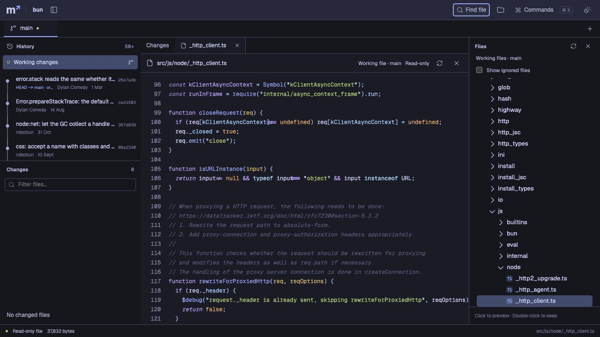

# File browsing validation

Date: 19 September 2026. Production build; Apple M1 Pro, 16 GiB memory; Node 24.19.0.

## Performance

The ignored Bun checkout has 19,810 tracked entries. Its browse manifest contains 21,768 entries including directories and 19,801 regular files. Git entries such as symlinks are not counted as regular files.

| Production host request                        | Measured time |
| ---------------------------------------------- | ------------: |
| Worktree manifest, first request to a new host |        665 ms |
| Worktree manifest, two repeat requests         |    459–469 ms |
| Commit manifest, first request                 |        234 ms |
| Worktree README read, median of five           |       3.61 ms |
| Commit README read, median of five             |      42.06 ms |
| 1,297,780-byte / 40,000-line text fixture      |      51.45 ms |

README is 26,195 bytes. Timings include HTTP transfer and JSON decode. They exclude browser parsing, highlighting, layout, and paint. OS caches were not cleared. Repeat manifest requests still execute Git/filesystem work; no manifest cache is claimed. Raw data and source identities: [browse-benchmark.json](browse-benchmark.json).

The benchmark confirmed unchanged refs, status, and index fingerprints for Bun and both test worktrees. It did not run Bun code. Binary and 9 MiB fixture responses contained no text.

## Browser and correctness checks

- Unit suite: 284 tests. Covers source identity, cancellation, per-workspace tab state, worktree/commit reads, unusual paths, symlink confinement, byte/line limits, authorization, and watcher behavior.
- Real Chromium suite: 35 tests pass. Checks cover the application, worker-backed themes, the file tree and picker, full-file rendering, and the Space leader.
- A 40,000-line plain-text file mounts fewer than 300 code rows and calls no syntax worker. Line 39,000 can be reached directly. A 250,000-character line is also covered.
- The production UI was checked with Bun and a linked-worktree fixture. Double-click opens the current file. Binary content shows metadata. Space–Space opens the scoped picker, and `file:line` navigates to that line.
- The diff surface stays mounted while a full file is visible. Current and historical file tabs use explicit source labels. Workspace changes cannot reuse content from another source.
- Manual testing found two navigation defects that now have regression coverage: Enter after asynchronously loaded or empty search results, and revealing a file inside collapsed parent folders. Both were rechecked in the final production Bun view. No browser warnings or errors were recorded during that check.

Formatting, Oxlint, TypeScript, production build, and package dry-run checks pass. The build still reports its existing large-chunk warning; this work does not claim a reduced initial bundle.

The HTTP measurements are not an end-to-end render benchmark. The host loads bounded files in full; it does not stream large-file ranges. Files above 8 MiB, 200,000 lines, or 250,000 characters on one line show metadata only. The manifest has a 50,000-entry cap. See [implemented behavior and limits](../FILE_BROWSING.md).

## Review order

1. `src/shared/browse.ts`, then `src/host/repository/browse.ts`: source contracts, confinement, text limits.
2. `src/web/data/browse.ts`, then `src/web/data/file-workspace.ts`: scoped requests, cancellation, bounded tabs.
3. `src/web/components/RepositoryFiles.tsx`, `FilePicker.tsx`, `FullFileView.tsx`, and `App.tsx`: navigation and integration.
4. `tests/host/browse.test.ts`, `tests/data/file-workspace.test.ts`, and the new browser tests: observable behavior and regressions.
