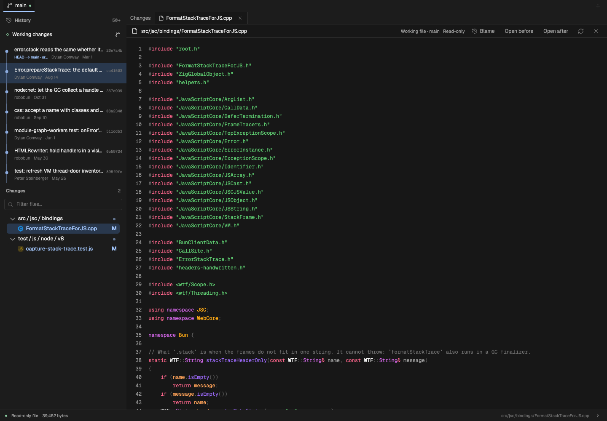
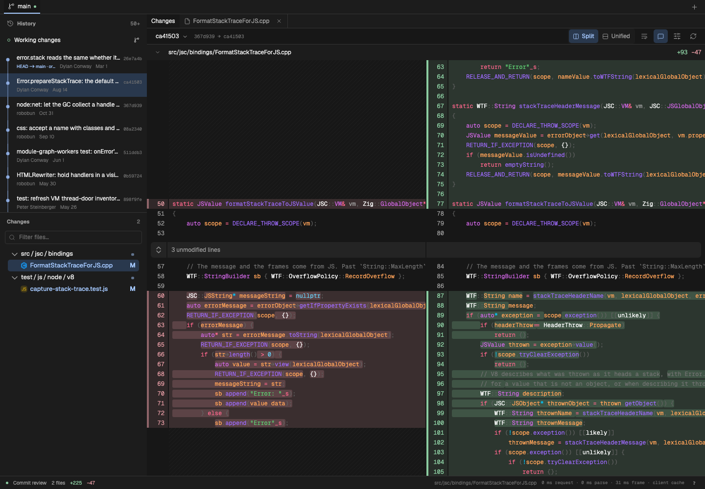

# Hover prefetch and render stability

Validated on macOS with the production build and the local Bun checkout, 20 September 2026.

## Behavior

- Hover over a file in either tree or a full-file link to start a read. Keyboard focus on a full-file link does the same.
- The click shares that request. A completed prefetch is used once; normal reads and refreshes remain fresh.
- At most two speculative operations run, including syntax work. Retained content is limited to eight entries / 4 MiB, with a five-second lifetime and a 2 MiB per-entry limit. Worktree invalidation clears speculative entries.
- Small text files use Pierre's `primeFileHighlightCache` with the same key as the visible file. Binary, plain fallback, and large files skip syntax prefetch. No new dependency.
- Enter advances diff-search hunks; Shift+Enter reverses. Both wrap.
- Branch rows are 29 px, file tabs 28 px, comparison toolbar 33 px. File and diff headers have a 32 px minimum. UI text remains 12 px.

## Layout error

Reproduced `VirtualizedFileDiff.render: rendered a different diff than its prepared layout` by selecting a commit again while asynchronous syntax work completed. The prepared and rendered objects had equal cache keys but different object identities.

`publishReview` previously cloned metadata on each selection, including an unchanged review. It now retains renderer-owned metadata for that review. A different review still receives separate objects, so Pierre's in-place context expansion cannot modify the canonical review cache. The comparison viewer also remounts when the review ID changes. Context loads check their review ID.

The failing production sequence passed after the fix. This does not prove every possible trigger is removed. The command palette now includes **Download render diagnostics**. It exports the last 80 events and the most recent error snapshot from the current browser session. Reports include comparison IDs, paths, cache keys, layout settings, and prepared/rendered identity details. They contain no source text or URL tokens and are not sent to a service. Optional reads of Pierre's internal metadata fields are used only for diagnostics; rendering does not depend on them.

## Measured results

See [raw results](hover-density.json). Chromium at 1440 × 1000; warm OS caches. Times include Playwright input scheduling and two animation frames after readiness. They are end-to-end test timings, not isolated renderer timings.

| Check                          | Result                            |
| ------------------------------ | --------------------------------- |
| 24 commit switches             | median 98 ms; p95 181 ms          |
| Re-select the same commit      | 8 repetitions; no render errors   |
| Open prefetched 39 KB C++ file | 67 ms; zero extra read requests   |
| C++ syntax visible             | 854 ms after click in this sample |

Hover preceded the click by 250 ms. Syntax prefetch starts work earlier; it does not guarantee that an uncached language or a full-file parse finishes before the click. The screenshot below was taken after syntax finished.





## Reproduce

```sh
npm run build
node scripts/benchmark-navigation.mjs .benchmarks/bun
```

The script starts and stops its own local host. It uses Bun's recent history, switches split/unified views, reselects a commit, opens a file from hover, saves screenshots, and reports console errors. It does not check out branches or change repository files.

Validation: all 79 browser tests passed. The full unit suite passed 329 tests with six existing skips; an additional late-prefetch invalidation regression passed in the focused final run. Type checking, lint, formatting, and the production build passed.
