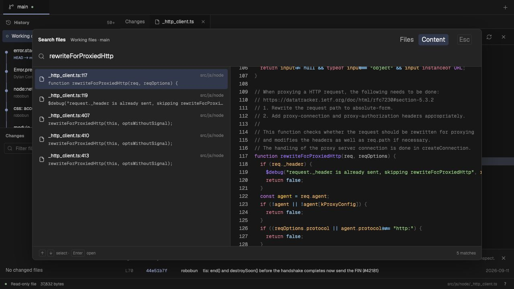
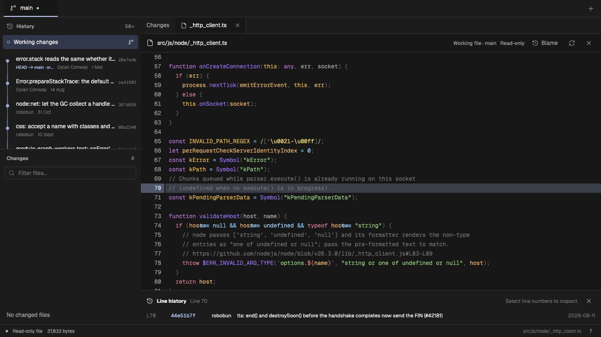
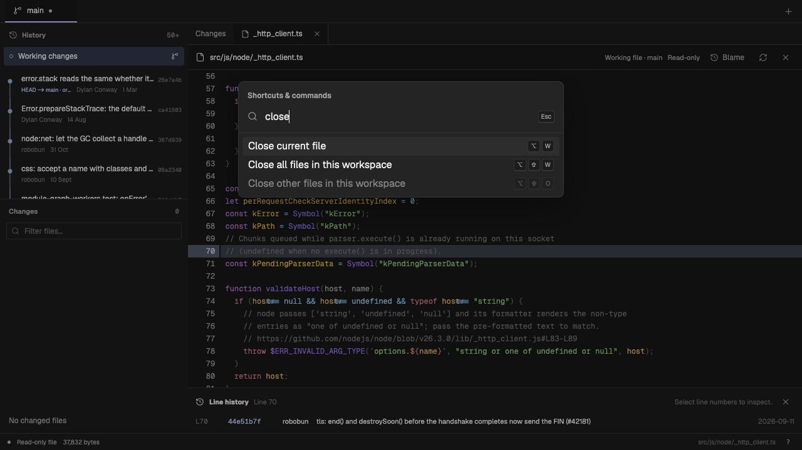

# Navigation, previews and blame validation

Validated on 19 September 2026. This extends the earlier [file browsing baseline](FILE_BROWSING.md). No runtime dependencies were added.

## Results

- 299 unit tests passed across 25 files.
- 46 Chromium tests passed across 6 files. The final controlled branch-picker change was then checked with the 16-test App suite.
- TypeScript, Oxlint, Oxfmt and the production build passed.
- Browser tests use real wheel input to verify full-file scrolling, prevent document scrolling, and keep the rendered row count below 300. They also check line selection, stale blame cancellation, preview scroll restoration, source isolation and close actions.
- In the running app against Bun, wheel input moved the full-file view from its first lines to later lines. Selecting line 70 displayed its Git attribution. A content search for `rewriteForProxiedHttp` returned five matches and showed the matching line in the preview. Resume restored the content mode and query.

The scroll defect was a missing `overflow: auto` on the element that owns the Pierre CodeView viewport. The fix keeps Pierre's own virtualization.

## Search measurements

These are single samples of the host search function against the local Bun checkout: 19,810 tracked entries, with a 200-commit shallow history at `26e7a4b3690dce60d4dcd7f47a12b531deb00837`. They exclude HTTP transfer and browser rendering. They are not latency percentiles or end-to-end timings.

| Query                | Host elapsed | Results       |
| -------------------- | -----------: | ------------- |
| `export`             |       698 ms | Capped at 200 |
| `setTimeout`         |     1,227 ms | Capped at 200 |
| Absent unique string |     3,739 ms | 0             |

[Raw measurement data](search-benchmark.json). No Bun code was executed.

Search is literal and case-insensitive. It uses a 200-match cap, a 64 MiB text scan budget and a 12-second deadline. The UI shows when results are incomplete. The existing binary and oversized-file limits also apply to previews.

## Scope and limits

The repository title bar is removed; branch tabs remain. Duplicate labels receive the shortest useful path context. This does not add support for opening several repositories in one window.

Picker previews do not change the active workspace view. Open/recent ranking and saved searches stay within the selected source. Recent paths and preview positions are bounded and remain in memory for the session. The preview panel is hidden below 700 px.

The installed Pierre Diffs 1.4.3 provides rendering and line selection, with no built-in Git blame API. The host obtains attribution from Git for up to 200 selected lines. Worktree requests check the exact content identity and HEAD before accepting the result. Blame is unavailable for files without history or files that require Git content conversion. Clean filters are not executed. A shallow clone can only attribute within its available history.

## Screenshots

File picker with preview:

Content search with matching-line preview:

Full-file scroll and selected-line blame:

Searchable shortcut guide with keycaps:

## Suggested review order

1. `src/web/components/FullFileView.tsx`: viewport overflow, scroll restore and selected-line blame.
2. `src/web/components/FilePicker.tsx`, then `src/web/data/picker-preview.ts`: preview lifecycle, source-scoped search sessions and stale-request handling.
3. `src/host/repository/inspect.ts`, then `src/shared/inspect.ts`: bounded search, blame identity checks and wire schemas. `tests/host/inspect.test.ts` covers the clean-filter guard.
4. `src/web/App.tsx`, then `src/web/components/Controls.tsx`: shell, commands, keyboard handling and semantic keycaps. `src/web/data/file-workspace.ts` contains scoped close actions; `src/web/data/tab-labels.ts` resolves duplicate labels.

The full feature status and shortcut table are in [the Snacks review](../SNACKS_REVIEW.md).
