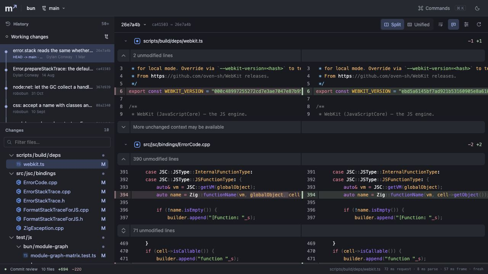
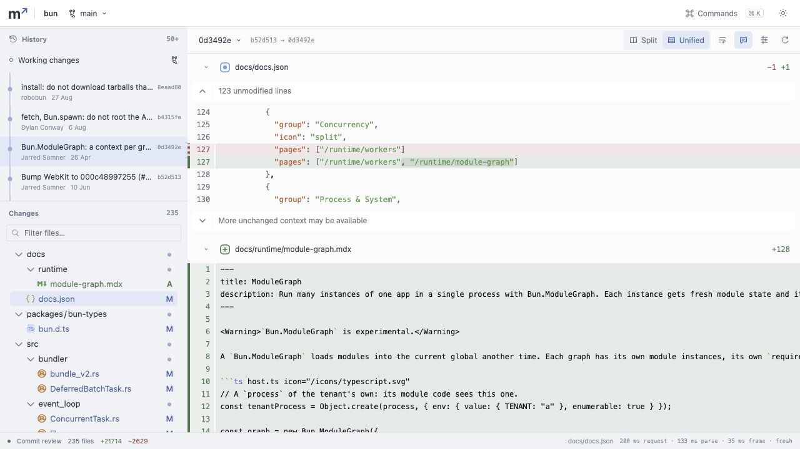

# Validation results

Measured on 19 September 2026. This report covers the first integrated application. It does not claim complete Hunk runtime parity.

## Repository and runtime

- Public `oven-sh/bun` source checkout: **19,810 tracked files**, **200 commits**, single-branch shallow history.
- HEAD: `26e7a4b3690dce60d4dcd7f47a12b531deb00837`.
- Largest sampled change: `0d3492e353f38ced6288b5b6fb27724d66b588f3`, **235 files**, **1,848,465 patch bytes**, +21,714 / −2,629 lines.
- Apple M1 Pro, arm64 macOS, 16 GiB RAM. Host benchmark: Node **24.19.0**.
- No Bun source, build, package script, or test was executed. Only Git reads were required. HEAD remained unchanged.

## Host measurements

[`benchmark.json`](benchmark.json) contains all samples and hardware details. Run `node scripts/benchmark.mjs .benchmarks/bun` after a production build to repeat the test. It starts its own local host and closes it when done.

| Measurement                            |                           Result |
| -------------------------------------- | -------------------------------: |
| Host ready                             |                           244 ms |
| Session query                          |                            49 ms |
| First 60 history entries               |                            38 ms |
| First request per commit, 24 samples   | p50 **49.8 ms**, p95 **70.5 ms** |
| Largest first request, 235-file change |                     **173.8 ms** |
| Repeat request per commit, 24 samples  |  p50 **2.4 ms**, p95 **23.2 ms** |
| Host RSS after all samples             |                    **120.3 MiB** |
| Request failures                       |                            **0** |

First request means uncached in this host. The OS disk cache was not cleared. Times include HTTP transfer and JSON decoding; they exclude browser parsing, syntax, and rendering. Host RSS excludes the browser and child Git processes. The slowest cached HTTP sample took 125.7 ms although its Git time was zero; the cause of that outlier was not isolated. The raw record retains it. This is one run on one machine, not a cross-platform guarantee.

## Browser observations

[`browser.json`](browser.json) preserves the footer readings from the production app in the Codex in-app Chromium browser at 1280 × 720. The shell and Pierre components were real, using the local host and Bun Git data.

| Selection                                       | Request | Parse / projection | First rendered frame |
| ----------------------------------------------- | ------: | -----------------: | -------------------: |
| 10-file commit                                  |   72 ms |               8 ms |                57 ms |
| Next, 2-file commit                             |   50 ms |               2 ms |                22 ms |
| Return to cached 10-file commit                 |    0 ms |               0 ms |                39 ms |
| 235-file commit after rapid keyboard navigation |  200 ms |             133 ms |                35 ms |

The parse value includes the worker round trip and projection. Frame timing starts at publication of the parsed review and ends at an animation frame after Pierre reports a render. It does not prove that every syntax worker has finished, measure sustained scroll FPS, or include all input event overhead. Cache hits shown as 0 ms mean those request/parse stages were skipped, not that navigation was instant.

The 235-file view remained usable with the file tree present. History loaded a second page. Split/unified mode and both themes worked. A real inline note was created against the local host during integration; it was removed after the check.

Dark, split, ten-file review:

Light, unified, 235-file review:

## Automated and package checks

- **256 unit/integration tests** passed in 18 files, including retained Hunk cases, response races, canonical-cache isolation from Pierre hydration, notes, linked worktrees, shallow parents, byte limits, path confinement, authentication, source races, and patch/file inputs.
- **9 Chromium tests** passed. These component tests mount the application and Pierre. They test commit changes, file filtering, find, theme changes, graph edges, input-only views, stale-note preservation, and metadata-file reveal. These use controlled HTTP fixtures; the screenshots and readings above use the production host.
- TypeScript, Oxlint, StyleX rule enforcement, and formatting passed. Production web and host builds passed.
- The npm tarball launched through **npx and bunx**, from a directory containing spaces. Both returned the session API and compiled application assets with HTTP 200. [Launcher results](package.json) records this check. The package has a Node shebang; this is not validation under the Bun runtime.
- Production dependency audit: **0 reported vulnerabilities**. Zod **4.6.5** was confirmed as the latest stable npm version and is pinned.

The browser build reports large chunks. The initial app chunk is about 416 kB gzip; syntax grammars and workers load separately. This is a working baseline, not a claim that startup bundle size is optimal.

## Issues found and fixed during integration

- Full-checkout watching exhausted file descriptors on Bun. Immutable browsing now watches Git metadata; live worktree views use native recursive watching where available.
- StyleX theme classes contain more than one token. The theme switch now applies each class separately.
- Stale notes could fall outside a new hunk. They now stay in a visible preserved-notes panel instead of relying on old inline coordinates.
- Metadata-only files had no reveal target. They now have explicit row targets.
- Pierre hydrates metadata in place. Canonical cache entries now remain private, and the renderer gets a separate copy.
- Batched key events could reuse a stale selected commit. The history panel now tracks pending keyboard selection synchronously.
- A floating-point render-version hash could collide and leave a removed inline note visible. A monotonic version counter and inline create/delete regression test fix this. The final production check created and deleted a note through actual pointer/accessibility actions.
- Same-ID refresh could display an earlier frame time. Each publication now clears the value and rejects obsolete frame callbacks.

## Limits and next measurements

- This clone has 200 commits, not Bun's full history. The graph shows HEAD ancestry, not every branch.
- No sustained FPS, long-frame, browser-heap, cold-disk, Windows, Linux, Firefox, or Safari result is claimed.
- Working-tree save latency, worktree switching, rename-heavy changes, and many hydrated files need dedicated performance runs. Tests cover parts of their correctness, not production latency.
- Patch transfer and parsing remain whole-review operations with byte limits. Virtualization does not make that work free. Canonical caches have bounds; active Pierre render models require separate memory profiling.
- Very large/non-text changes have explicit limitations. Standalone patches do not provide full-source context. Patch/file inputs use manual refresh.
- Notes are session memory. Native desktop packaging, persistent notes, Hunk agent/extension compatibility, JJ/Sapling, rich STML, and merge editing are not implemented.
