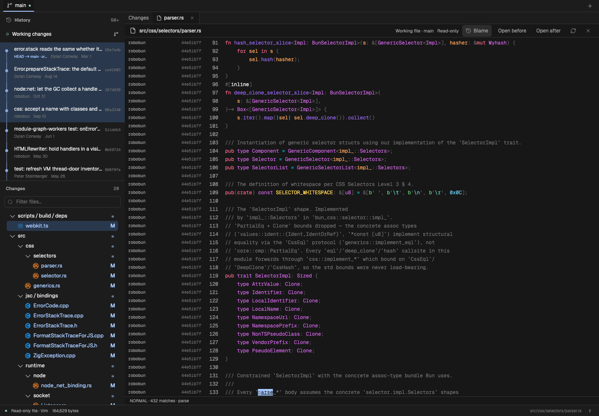
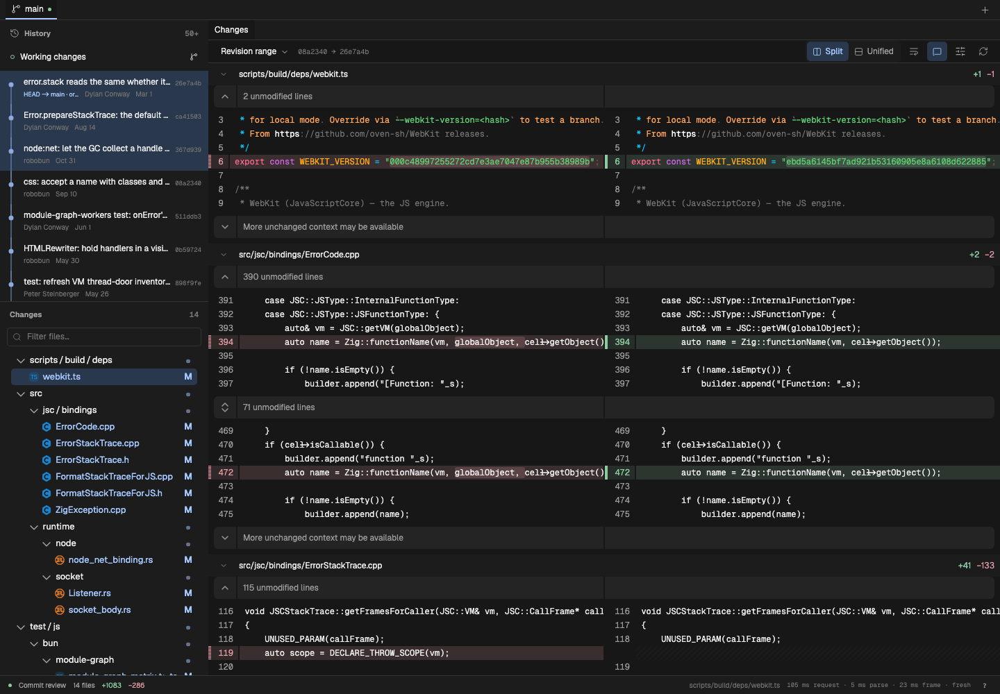
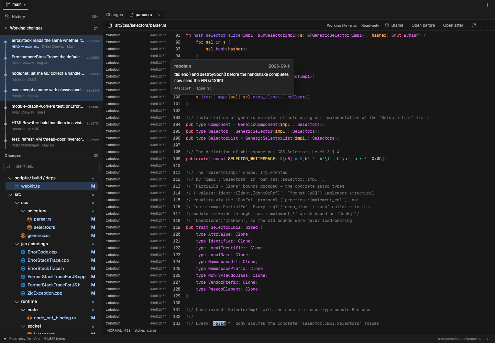

# Search, definitions, range review, and gutter blame

Validated on macOS with production Chromium against the Bun checkout. No code from Bun was executed.







## Behavior

- Vim search gives the match under the cursor an accent fill and underline. Other matches keep the search color. `n` and `N` move this range; Escape clears it. The painter looks up the cursor offset in sorted search results and paints one mounted text range. It does not change syntax tokens or run a React render for each motion.
- `gd` looks for exact Universal Ctags declarations in the displayed file snapshot. If none match, it queries the existing ctags-backed Zoekt index. One candidate opens directly; multiple candidates open a definition picker. Project results open their indexed commit, not an assumed worktree line. This is declaration lookup, not semantic type or import resolution. Project lookup requires the symbol index. Missing tools, unsupported languages, and stale file bytes produce a message.
- Drag the native Pierre gutter plus across lines to open a note for that range. Dragging or Shift-clicking the line numbers and then using Add note also works. The plus hit area no longer covers the adjacent number. Notes retain the complete same-side range.
- Shift-click and Shift+Up/Down extend a commit selection. The host compares the oldest selected commit's first parent with the newest selected commit. Root commits use an empty tree; missing shallow parents remain an explicit error. Merged history is compared as endpoint snapshots, not summed patches.
- Blame appears to the left of line numbers. Visible pages preload after opening the full file, even while blame is hidden. Toggling blame retains the cache. Picker previews do not preload blame. Base UI tooltips wait 250 ms initially, then open immediately between nearby lines, with a 600 ms grace period. Pierre pointer events remain enabled during scrolling so the first hover after a Vim jump is not lost. Hover a label for its date and commit message. Requests cover at most 200 lines each, with one request in flight and at most eight cached pages per displayed file. Attribution is removed when the file changes or becomes stale. The old bottom panel is removed.

## Measurements

Raw results: [review-features.json](review-features.json).

| Check                                                              | Result                                         |
| ------------------------------------------------------------------ | ---------------------------------------------- |
| Search key handler, 40 alternating `n` / `N` motions               | median 0.1 ms; p95 0.2 ms                      |
| `gd` from the Rust call at line 1607 to its declaration at line 50 | 38.5 ms                                        |
| Select a commit, then Shift-click to extend to three commits       | 381.4 ms combined                              |
| Eight repeated range changes                                       | 50–132 ms each                                 |
| Five rapid range changes without waiting for each response         | Passed                                         |
| First background blame page, lines 1–200                           | 61.7 ms HTTP duration                          |
| Cached blame toggle                                                | 55.4 ms including input and polling            |
| First tooltip / next tooltip                                       | 303.3 ms / 14.5 ms including input and polling |
| Mounted blame labels in the captured view                          | 65                                             |
| Browser errors                                                     | 0                                              |

This fixture is a 200-commit shallow Bun clone. Blame on a full history can take longer. Reads stay in 200-line pages with at most one request in flight and eight pages retained; the file remains usable while Git runs. Clicking before the first read completes can still wait for data.

Search timings cover synchronous input work, not display presentation. Definition, range, toggle, and tooltip timings include Playwright input and polling. These are single-run observations, not latency guarantees. The browser tests also cover tooltip hover at line 39,000, late-result cancellation, prefetch before toggling, no reads from picker previews, and saving notes with a real pointer drag.

Range responses now use a canonical comparison key instead of JSON property order; inclusive and exclusive ranges remain distinct. A cache hit also preserves the current request's label. The original mismatch did not reproduce against the running server or the rebuilt production server. If it recurs, `Comparison response mismatch` in the console records the requested and returned repository and comparison. No mismatched response is displayed.

Validation: 341 unit/host tests passed with six skipped. All 68 affected browser tests passed, including the symbol picker tests. Typecheck, lint, formatting, and the production build passed.

## Suggested review order

1. `src/shared/protocol.ts`, `src/web/data/controller.ts`, and `src/host/repository/review.ts`: comparison identity, mismatch details, and cache labels. Then `tests/data/controller.test.ts` and `tests/host/host.test.ts`.
2. `src/web/data/blame-gutter.ts` and `src/web/components/FullFileView.tsx`: bounded prefetch, cache lifetime, stale-file cancellation, and pointer behavior.
3. `src/web/components/BlameTooltips.tsx`, then `tests/browser/full-file.test.tsx`: tooltip delay group, mounted-row portals, and large-file checks.
4. `src/web/App.tsx` and the removed custom button in `src/web/components/NoteCard.tsx`: native gutter drag. Then `tests/browser/app.test.tsx` and `tests/browser/comments.test.tsx`.
5. `scripts/benchmark-review-features.mjs`, `vitest.config.ts`, and `docs/USAGE.md`: reproducible checks, tooltip dependency pre-bundling, and usage notes.

Reproduce after a production build:

```sh
node scripts/benchmark-review-features.mjs .benchmarks/bun
```
