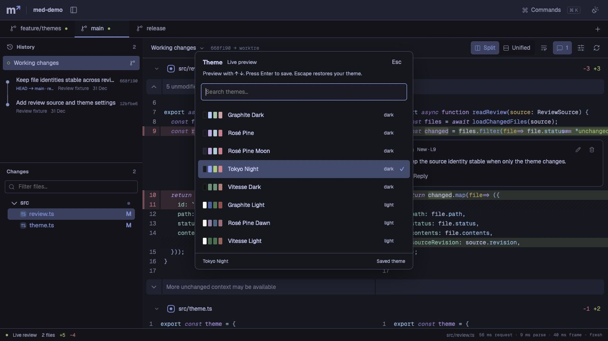
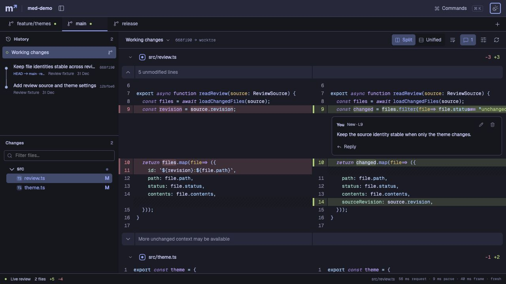
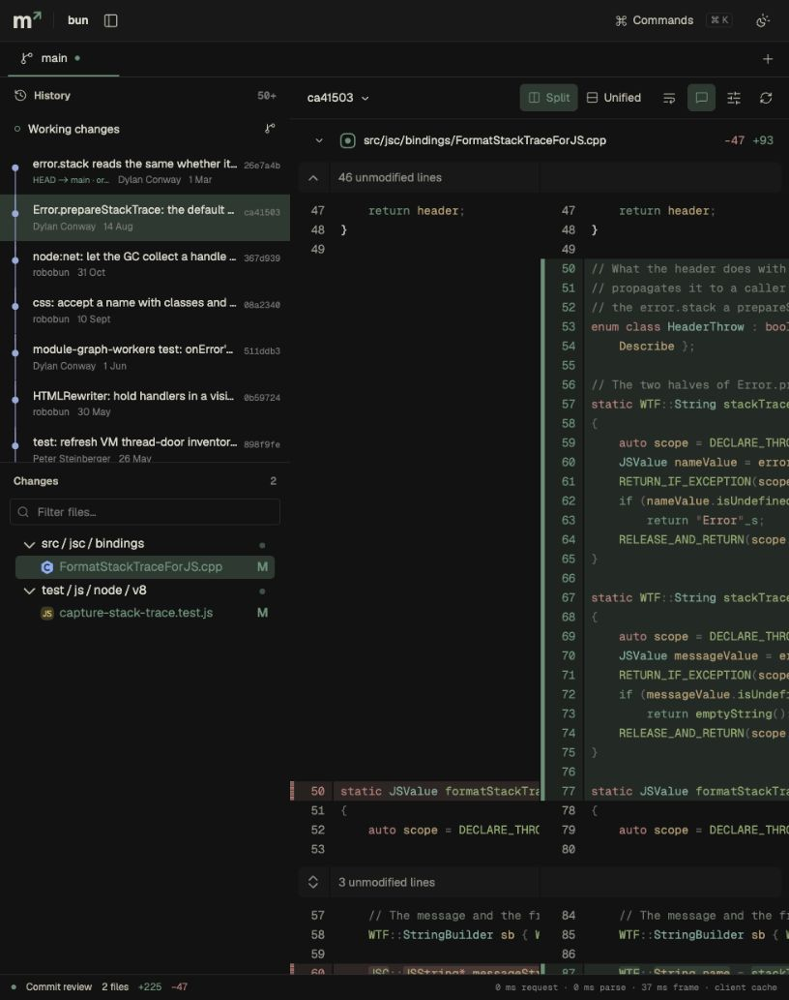

# Theme and workspace update

Validated on 19 September 2026 with Node 24.19.0 and Chromium. The screenshots show the production build, not design mockups.

Checks passed: 267 unit tests, 17 Chromium tests across four files, TypeScript, Oxlint, Oxfmt, and the production build. The package launches through both npx and bunx from a path with spaces; both serve the API, HTML, and valid WOFF2 fonts. See [package results](package.json).

## Bun timing samples

The final production build used Vitesse Dark at 816 × 1033. These are three sequential observations on the existing 19,810-file shallow Bun checkout, with warm OS caches. They are not percentile estimates or a sustained frame-rate test. [Raw samples](ui-browser.json) record the full commit IDs.

| Selection                | Files | Request/decode | Parse/projection | Publication to rendered frame |
| ------------------------ | ----: | -------------: | ---------------: | ----------------------------: |
| `ca41503`, new review    |     2 |          62 ms |             4 ms |                         47 ms |
| `26e7a4b`, host cache    |    10 |           8 ms |             5 ms |                         43 ms |
| `ca41503`, browser cache |     2 |           0 ms |             0 ms |                         37 ms |

The fresh review includes Git work; the cached samples do not measure checkout. No checkout occurs. Chromium reported no runtime errors in the final Bun session.

## Behavior checked

- Eight themes: Graphite Dark/Light, Vitesse Dark/Light, Rosé Pine/Moon/Dawn, and Tokyo Night. Keyboard highlighting previews; Enter saves; Escape restores. The saved theme survives reload. The shell, portals, tree, and syntax workers use the selected theme.
- Local branch tabs discover existing worktrees. The `feature/themes` fixture opens its own modified files. `release` has no worktree and opens a commit snapshot, with working-copy controls absent. Detached worktrees and stale worktree mappings have regression tests.
- Cmd+B hides and restores the sidebar in the production browser. The layout uses the released space.
- Comments save with Cmd+Enter, appear beside the selected source line, and offer compact edit/reply controls. A real Pierre renderer test checks that the action does not cover line number 1557.
- Fonts are local Geist and Geist Mono variable WOFF2 files (141,356 bytes combined). Icons are selected Lucide SVG paths with license notices. No runtime dependency was added.

The branch fixture is created by `scripts/create-ui-fixture.mjs` under ignored `.test-artifacts/ui-worktrees`. It has two commits, three branches, two working directories, and uncommitted edits. No reviewed source code is executed.

## Screenshots

Live theme picker, using the controlled Git fixture:

Inline comment and worktree tabs, using the same fixture:

Bun commit view with Vitesse Dark:

## Limits

Tabs cover local branches and discovered worktrees. The graph shows one selected ancestry, not a complete multi-branch graph. Opening a tab starts at its working changes or committed branch tip; per-tab navigation restoration is a later feature. Notes still live in host memory. Theme preferences are local to the browser origin.

[Baseline Bun performance](RESULTS.md) remains a separate measurement of the first implementation. Those numbers are not a new benchmark of this update. [Whole-file browsing](../FILE_BROWSING.md) is a proposed next step, not an implemented mode.
