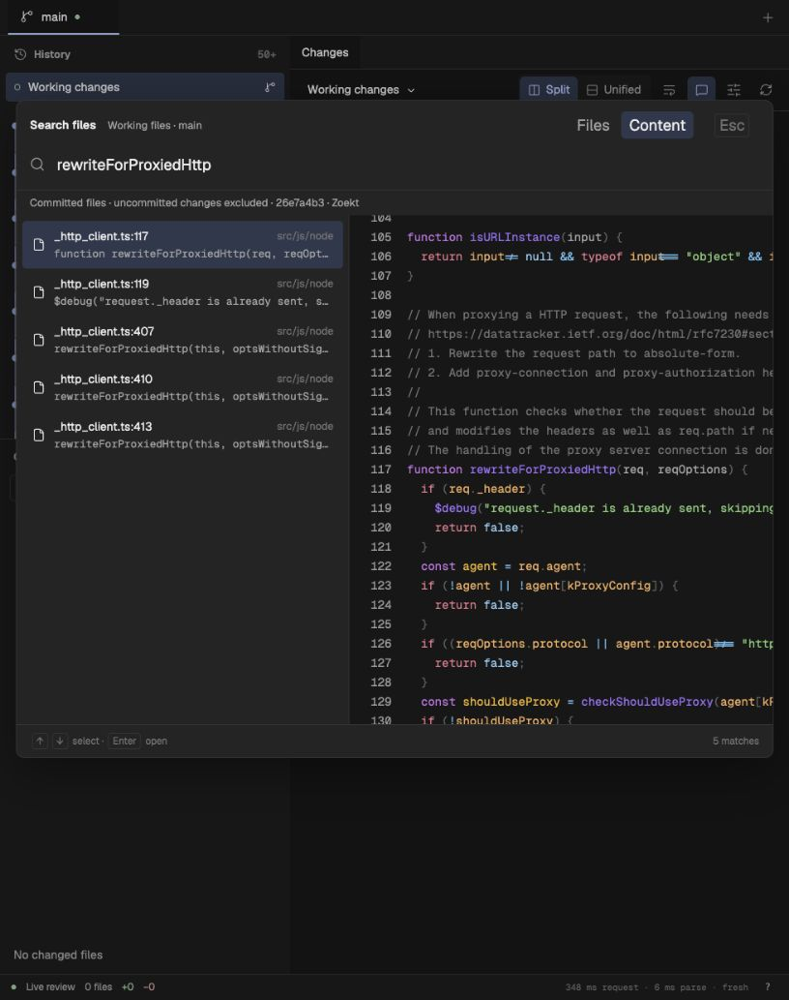
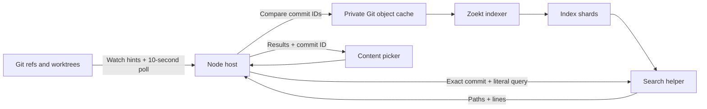

# Integrated branch search

Validated on 19 September 2026, macOS arm64, Apple M1 Pro, 16 GiB RAM.



## Runtime behavior

The Node host owns a pinned Zoekt indexer and a small Go search helper. The helper uses a private Unix socket. It does not open another TCP port. Go is required only for the explicit `--setup-search` build. No npm dependency was added.



- Unchanged commit IDs do not rebuild the index. A branch advance or rewind requests a delta build. Zoekt can compact deltas into a full build. Adding or removing an indexed branch requests a full build.
- Up to 64 local branch tips are indexed. Branches with worktrees take priority. Detached worktree commits use remaining slots. Remote-only refs and all historical commits are not indexed by default.
- Each canonical repository has one cache. A kernel lock prevents two viewers from owning it at once; the second viewer uses Git search. Normal shutdown stops active builds before releasing ownership.
- Source repositories are read-only. The app copies Git objects into a private bare repository. It does not install hooks, check out a branch, stage files, or run source-repository scripts.
- Content search resolves the selected worktree's HEAD once. Search results and previews use that immutable commit. Working changes are excluded. Filename browsing still reads the current worktree.
- During a build, after a failure, or for an unindexed historical commit, the host uses Git search against the same commit. Missing or corrupt index shards trigger a full rebuild.
- Search is literal and case-insensitive. User input is not parsed as Zoekt query syntax. The helper returns at most 200 matching lines, with bounded snippets and response bytes. Broad results can be truncated below 200 lines because of Zoekt's internal budget and file grouping.

## Built-host API latency

Bun commit `26e7a4b3690dce60d4dcd7f47a12b531deb00837`, one indexed branch, 19,810 tracked paths. Ten warm trials after one warmup for each query, measured serially. The OS cache was not cleared.

These times include HTTP, JSON decoding, HEAD resolution through Git, the host adapter, and the Unix socket search. They exclude the picker debounce, preview file reads, and browser rendering. This is a desktop sample, not a controlled-load percentile test.

| Query                   |   Median |           Range | Returned lines |
| ----------------------- | -------: | --------------: | -------------: |
| `rewriteForProxiedHttp` | 11.49 ms |  10.43–13.48 ms |    5, complete |
| `setTimeout`            | 18.30 ms | 16.03–103.30 ms | 199, truncated |
| `export`                | 14.75 ms |  12.03–31.62 ms | 186, truncated |
| Absent string           | 11.26 ms |   9.91–37.18 ms |    0, complete |

[Raw API samples](zoekt-integration.json). The earlier [engine benchmark](ZOEKT.md) measures index costs and ten related branch snapshots; its 1–3 ms engine timings do not represent the complete app API.

## Checks

- 309 unit/integration tests pass, including six cases using the actual Zoekt binaries.
- 48 Chromium browser tests pass, including search resume after opening a result.
- Seven Go helper tests pass. Both macOS arm64 and Linux amd64 binaries compile; Omarchy runtime behavior has not been tested on a Linux machine.
- TypeScript, Oxlint, formatting, and production builds pass.
- Explicit CLI setup builds both pinned tools in the user cache. Repeat setup reuses a complete installation.
- Real Git fixtures cover linked worktrees, new commits, branch creation/deletion, commit rewinds, historical fallback, missing binaries, cancellation, literal-query isolation, source-repository preservation, cache reuse, cache ownership, and missing/corrupt shard recovery.
- The macOS UI shows five Bun results with `26e7a4b3 · Zoekt`. Enter opens `_http_client.ts` from that same commit at the selected line.

Run the normal checks from the README. To include the real-binary service tests, first run setup, then point the tests at the directory printed by that command:

```sh
MED_TEST_ZOEKT_BIN=/path/printed/by/setup npm run test:unit
cd tools/zoekt
go test ./...
```

The Go lock test also verifies exclusive ownership and that the lock file retains its inode. A separate process check verified lock release after SIGKILL and normal EOF shutdown. This does not claim complete host-crash testing during an active index build.
