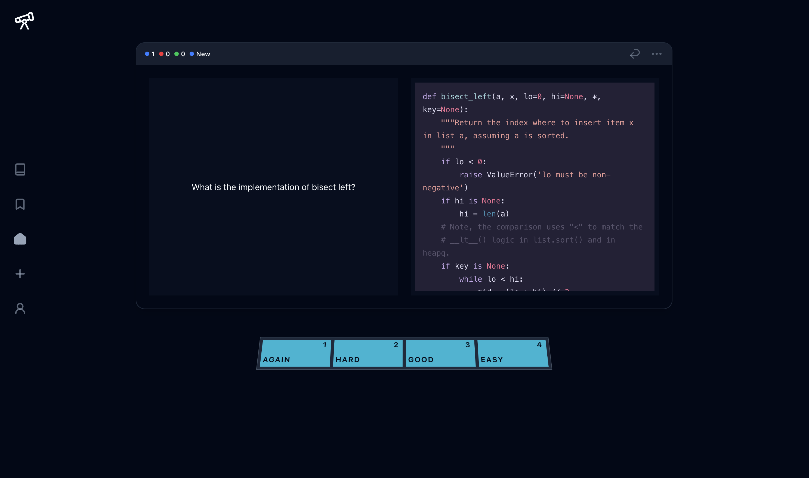
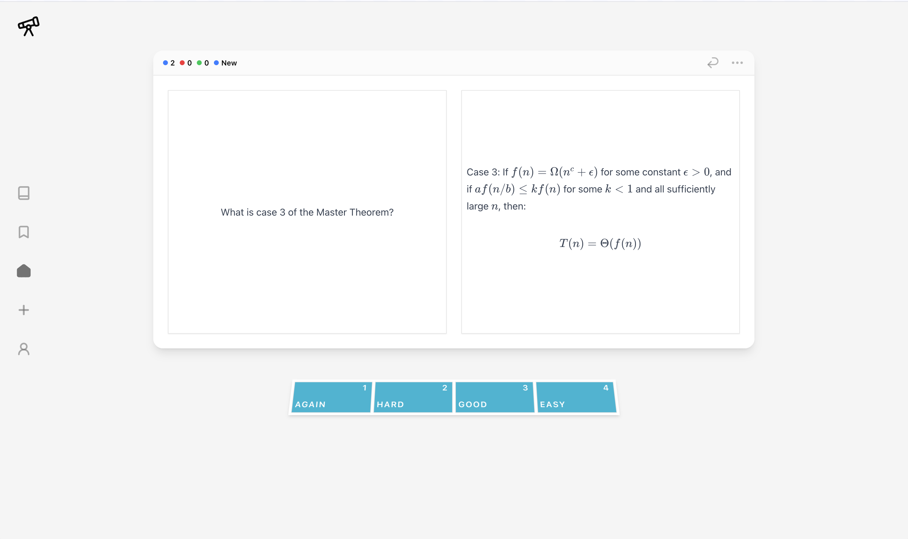
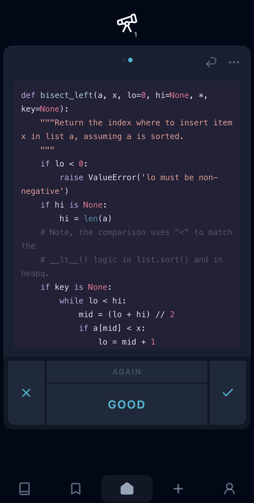
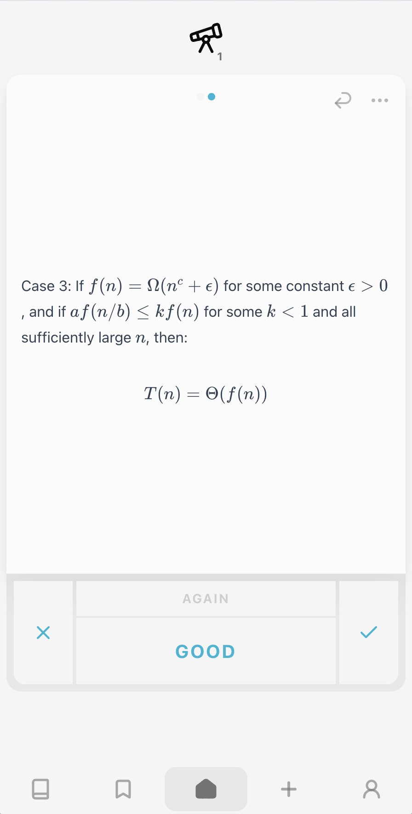
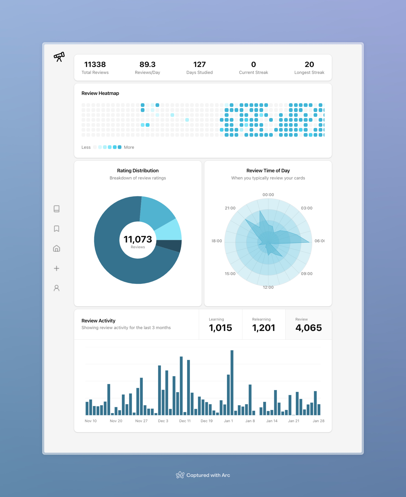

# Spaced

## Workbench app

The canonical source is `apps/spaced2` in Workbench. Use the root Bun install;
there is no app-local lockfile or separate Git repository.

```sh
# From the Workbench root
bun install --frozen-lockfile
bun run dev:spaced2
# In a second terminal
bun run dev:spaced2-server
bun run test:spaced2
bun run build:spaced2
```

The UI uses port 5180 and the local API uses port 8791. App-local environment
files and Wrangler state stay in this directory and out of Git. Production
remains `https://spaced2.zsheng.app`; `bun run deploy:spaced2` is an explicit
production deployment. Moving this repository does not migrate production data.
Read [architecture](ARCHITECTURE.md) and the
[migration notes](../../docs/SPACED_MIGRATION.md).

## What is this?

Spaced is a modern flashcard application that uses the Free Spaced Repetition Scheduler (FSRS) algorithm to help you learn efficiently. It's designed to be fast, offline-capable, easy to use, and visually appealing.

### Features

- 📱 **Progressive Web App** - Works offline and installable on both desktop and mobile
- ⚡ **Fast** - Everything is local-first so the UI is fast and responsive
- 🔄 **Sync** - Review cards on desktop or mobile with automatic sync
- 📊 **Rich Statistics** - Track your learning progress with detailed analytics
- 💻 **Modern UI** - Clean, intuitive, hand-crafted UI

### Screenshots

#### Desktop Dark



#### Desktop Light



#### Mobile

<p align="center" style="display: flex; justify-content: center; gap: 20px;">
  
  
</p>

#### Stats



## Why I built this

See [MOTIVATION.md](docs/MOTIVATION.md)
