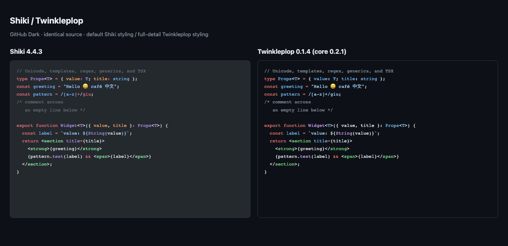

# Syntax highlighting comparison

This benchmark compares med's current Shiki JavaScript engine with Twinkleplop in Chromium workers. It does not change med's renderer or dependencies.

## Result

**Twinkleplop is much faster on the tested TypeScript and TSX files. It is promising for a prototype, but is not ready to replace Shiki across med's supported languages.** The main limits are language coverage, embedded-language handling, CRLF HTML output, and the missing Pierre adapter.

Measured on 2026-09-23, Apple M1 Pro, macOS arm64, Chromium 153.0.8010.12. Each range below shows the two rounds' medians; it is not a confidence interval. Lower is better.

| Input                       |     Size |       Shiki tokens | Twinkleplop tokens |         Shiki HTML | Twinkleplop HTML |
| --------------------------- | -------: | -----------------: | -----------------: | -----------------: | ---------------: |
| med blame component (TSX)   |   3.5 KB |        5.0–10.1 ms |         0.6–1.1 ms |        5.7–13.5 ms |       0.4–0.9 ms |
| med App (TSX)               |  87.8 KB |     440.9–448.3 ms |        6.4–13.7 ms |     450.1–453.2 ms |      7.7–16.2 ms |
| med controller (TypeScript) |  55.1 KB |     113.2–182.2 ms |         5.0–9.8 ms |     119.8–219.7 ms |      5.5–10.6 ms |
| Bun HTTP/2 (TypeScript)     | 266.0 KB | 1,642.8–1,811.8 ms |       11.1–22.8 ms | 1,644.4–1,862.3 ms |     13.1–32.5 ms |
| med CSS                     |   0.6 KB |             0.1 ms |            <0.1 ms |             0.2 ms |          <0.1 ms |
| med package JSON            |   1.7 KB |             0.2 ms |            <0.1 ms |             0.4 ms |      <0.1–0.1 ms |
| med agent guide (Markdown)  |  11.6 KB |       11.7–11.9 ms |         0.2–0.4 ms |       11.8–14.1 ms |       0.2–0.5 ms |

Some sub-millisecond samples round to zero at the browser timer's resolution. They are not zero-cost operations. Run order/JIT/GC effects are visible, especially for smaller inputs. The Markdown row does **not** compare equal embedded-language coverage; see the quality results below.

| Fixed five-language worker                      |          Shiki |  Twinkleplop |
| ----------------------------------------------- | -------------: | -----------: |
| Startup through first token result, median of 7 |       177.2 ms |      23.7 ms |
| Startup range                                   | 158.6–218.8 ms | 20.9–31.6 ms |
| Minified JavaScript                             |       717.2 KB |     196.0 KB |
| Gzip JavaScript                                 |       112.3 KB |      48.3 KB |

Bundle sizes include the benchmark worker wrapper and the five selected languages, not the whole med app or every supported language. Twinkleplop's visual theme CSS is a separate 9.5 KB file. med normally loads grammars as needed, so this fixed preload measurement is not med's actual startup profile.

## Output quality

- Both engines recognized the selected TSX comments, type alias, string, regex, export keyword, function name, and HTML tag names. Styling differs: for example, Shiki provides more detailed scopes inside regex literals. This is a small diagnostic sample, not a full grammar accuracy score.
- All token spans in all five diagnostic inputs had valid, ordered source ranges, including Unicode and CRLF. This does not prove every non-whitespace character has the correct classification.
- Both preserved browser-visible source text for LF input, Unicode, empty lines, an incomplete edit, and a long string followed by an empty line.
- **Twinkleplop's direct HTML renderer introduced extra line breaks for CRLF input:** the 15-line probe became 29 lines after parsing the HTML in the browser. A `\r` before closing span markup becomes a newline, followed by the emitted `\n`. Shiki kept 15 lines. Twinkleplop's token ranges were valid; this failure concerns the HTML output path. A token-to-Pierre adapter must handle line endings explicitly.
- **Markdown fenced TypeScript was highlighted by Shiki but remained `raw_code_block` in Twinkleplop's default Markdown language factory.** Twinkleplop has separate Markdown integration packages, but these were not configured in this engine benchmark. Adding embedded tokenization would add work and needs another measurement.



[Open the HTML comparison](highlighters-comparison.html). [Raw timing and quality data](highlighters.json) contains every timed sample. [Detailed output checks](highlighters-quality.json) records expected/actual line counts and the CRLF mismatch.

## Recommendation

Keep Shiki as med's default for now. The next useful experiment is a TypeScript/TSX token adapter into Pierre, with Shiki retained for unsupported languages. Measure that complete path on the same files before deciding whether its speed benefit justifies the added maintenance. Include theme mapping, CRLF, comments, selections, and mixed-language files in that check.

This result does not compare Twinkleplop against Shiki's WASM engine. That remains another available option in Pierre and needs its own measurement before a final engine choice.

Follow-up: the [Pierre integration probe](PIERRE_HIGHLIGHTER_REPLACEMENT.md) confirms that Shiki tokenization is not required at the file/diff rendering boundary. It preserves line metadata, word-diff markers, and light/dark colours using Twinkleplop tokens, and avoids the direct HTML renderer's CRLF issue. A permanent Shiki fallback is a coverage choice, not an architecture requirement.

## Reproduce

Run from the med checkout. Install the experimental dependencies in the ignored benchmark directory:

```sh
npm install --prefix .benchmarks/highlighters --ignore-scripts --no-audit --no-fund \
  @twinkleplop/core@0.2.1 \
  @twinkleplop/typescript@0.1.4 @twinkleplop/tsx@0.1.4 \
  @twinkleplop/css@0.1.4 @twinkleplop/json@0.1.4 \
  @twinkleplop/markdown@0.1.4 @twinkleplop/theme-github@0.2.1
node scripts/benchmark-highlighters.mjs
```

For output checks without repeating the timed runs:

```sh
node scripts/benchmark-highlighters.mjs .benchmarks/highlighters/quality --quality-only
```

The script uses the Bun checkout at `.benchmarks/bun`. The JSON records both repository revisions and a SHA-256 hash for each input. To reproduce the original corpus, use those revisions. New source changes produce a different workload.

## Method

- Production Vite bundles, headless Chromium, dedicated module workers on local loopback.
- Shiki 4.4.3 uses `createJavaScriptRegexEngine`, which is Pierre's default in med. This is **not a Shiki Oniguruma/WASM benchmark**.
- Twinkleplop language packages 0.1.4 use core 0.2.1 and `fidelity: "high"`. No annotation plugins or source transforms are enabled.
- Both bundles contain TypeScript, TSX, CSS, JSON, and Markdown. Shiki includes GitHub Dark; Twinkleplop uses its GitHub Dark CSS for the visual check.
- Startup: seven new workers per engine, alternating engine order. Time includes local bundle loading, module evaluation, initialization, and the first tokenization of the blame component. This does not clear OS or browser code caches.
- Repeated work: three warmups, then eleven timed calls per file and output mode. Two independent worker rounds reverse engine order. Every call recalculates output; there is no rendered-result cache.
- Token timing compares Shiki `codeToTokensBase` with Twinkleplop's language token factory. HTML timing includes tokenization and HTML generation for both engines. The JSON also records Shiki `codeToHast`, the output kind used by Pierre.
- These are engine measurements. They exclude Pierre's transforms, worker result transfer, React, virtualized diff layout, and screen rendering. No full med startup or file-open speedup is claimed. med also caps syntax highlighting for very long lines; the diagnostic long-line probe deliberately has no cap.

## Integration limits

Pierre 1.4.3 supports `shiki-js` and `shiki-wasm` as its highlighter choices. Its worker calls Shiki `codeToHast` and applies Pierre transforms for line/diff metadata. Twinkleplop returns typed source ranges or HTML. It cannot be selected through the current Pierre option.

An adapter would need to preserve source offsets, whitespace, line boundaries, colours, and Pierre's diff metadata. Its conversion and transfer costs are not measured here. Twinkleplop's token types also differ from Shiki's theme scopes, so med's current themes need an explicit mapping.

The npm language search on 2026-09-23 found no C, C++, or Zig packages. Direct lookups for `@twinkleplop/c`, `@twinkleplop/cpp`, and `@twinkleplop/zig` returned 404. Bun contains C++ files, so a full replacement would lose coverage unless those grammars are added. A hybrid would still need Shiki and would retain both engines' costs.

Sources: [Twinkleplop](https://github.com/pngwn/twinkleplop), the installed package source/types, and med's installed Pierre worker source. Package availability was checked through the npm registry.
